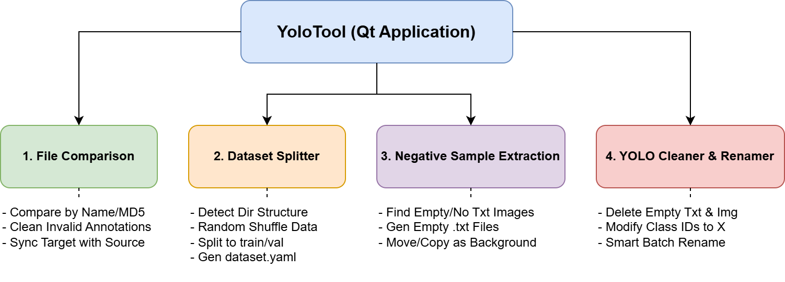

# FileCompareTool (資料處理與比對工具)

FileCompareTool 是一個基於 Qt 開發的圖形化介面應用程式，專門用來處理、清理與優化 YOLO 格式的資料集。
此資料夾包含編譯好的 Windows 執行檔 `FileCompareTool.exe` 及其所需的動態連結庫 (DLL) 與依賴檔案。

## 執行方式
直接雙擊執行 `FileCompareTool.exe` 即可開啟圖形化工具介面。

---

## 預期的資料夾結構 (重要)
為確保程式能正確讀取圖片與標註檔並避免發生錯誤 (Bug)，請確保您選擇的來源資料夾符合以下兩種結構之一：

### 1. 標準 YOLO 結構（建議）
根目錄底下包含 `images` 與 `labels` 資料夾。程式會自動往下尋找子目錄（如 `train`, `val`）或直接讀取裡面的檔案。圖片與其對應的 `.txt` 標註檔必須擁有相同的「主檔名」。

```text
來源資料夾/
├── images/
│   ├── train/      (可選的子資料夾)
│   │   ├── image_001.jpg
│   │   └── image_002.png
│   └── val/        (可選的子資料夾)
│       └── image_003.jpg
└── labels/
    ├── train/      (可選的子資料夾)
    │   ├── image_001.txt
    │   └── image_002.txt
    └── val/        (可選的子資料夾)
        └── image_003.txt
```

### 2. 單層平坦結構
若無 `images` 與 `labels` 目錄，程式會退回單層模式，將您選取的資料夾同時視為圖片與標註檔的根目錄。這意味著您的圖片與對應的 `.txt` 標註檔應放在同一個資料夾中。

```text
來源資料夾/
├── image_001.jpg
├── image_001.txt
├── image_002.png
└── image_002.txt
```
> **注意**：不論使用何種結構，標註檔必須是 YOLO 格式的 `.txt`，且每個有效的標註行必須至少包含 5 個數值（Class ID 與 4 個坐標點）。

---

## 架構圖



## 主要功能介紹

工具介面上方提供了四個主要分頁，針對 YOLO 資料處理的不同階段提供自動化輔助：

### 📁 1. 檔案比對 (File Comparison)
用來比對多個「來源資料夾」與單個「目標資料夾」的內容差異，並提供進階清理功能。
*   **比對方式**：支援依據「完整檔名」、「主檔名」或「檔案內容 (MD5)」進行比對。
*   **同步清理無效標註**：自動掃描目標資料夾，刪除無效的 `.txt` 標註檔（無座標或空檔）並同步刪除對應圖片。
*   **檔案同步操作**：
    *   將目標中與來源相符的檔案刪除。
    *   刪除來源中「不存在於目標」的檔案，方便進行資料同步與篩選。

### 📊 2. 切割 Dataset (Dataset Splitter)
將整理好的圖片與標註檔切割並轉換為標準 YOLO 訓練目錄結構 (`images/train`, `images/val`, `labels/train`, `labels/val`)。
*   **智慧偵測**：自動偵測來源是標準 YOLO 結構或是單層資料夾。
*   **隨機切割**：支援自訂 Train/Val 比例 (預設 80% 訓練集)，自動對資料進行隨機洗牌 (Shuffle)。
*   **自動生成設定檔**：在處理過程中，會掃描所有標註檔內出現過的 Class ID，並自動在輸出目錄建立 `dataset.yaml` 供後續訓練直接使用。

### 🖼️ 3. 負樣本抽取 (Negative Sample Extraction)
快速從資料庫中過濾出「沒有標註檔」或「標註檔內無有效坐標」的圖片，將其抽離作為背景負樣本 (Background Images)。
*   **自動生成空標註檔**：可選擇自動生成對應的空白 `.txt`，符合 YOLO 訓練負樣本的格式需求。
*   **處理模式**：支援「複製」或「直接移動」檔案到指定的負樣本資料夾。

### 🎯 4. YOLO 清洗與改名 (YOLO Cleaner & Renamer)
對 YOLO 資料集進行最終的清理、標籤修改與檔案命名標準化。
*   **清理空檔**：自動刪除內容為空的標註檔以及其對應的圖片。
*   **批次修改類別 ID**：可將目錄下所有標註檔的 Class ID 統一更改為指定數字（例如統一改為 `0`）。
*   **智慧批次改名**：
    *   支援自訂前綴（如 `image_`）與指定數字長度補零（如 `00001`）。
    *   **智慧銜接**：程式會自動找出目前資料夾中符合規則的最大編號，並「只針對不符合命名規則」的檔案接續編號改名，不會破壞既有的標準命名檔案。

---

## 注意事項 (Notes)
*   請勿任意刪除或移動 `YoloTool` 資料夾內的 `.dll` 檔案與子資料夾 (如 `platforms/`, `styles/` 等)，這些是 Qt 應用程式運作所必需的依賴庫，缺少可能導致程式無法啟動。
*   本工具的 C++ 原始碼與 UI 設計檔為leo2783。https://github.com/leo2783
*   **開源協定**：MIT License
*   **開發者聯絡方式**：qet6322076690@gmail.com
