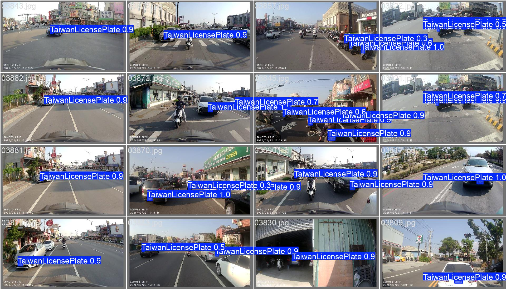
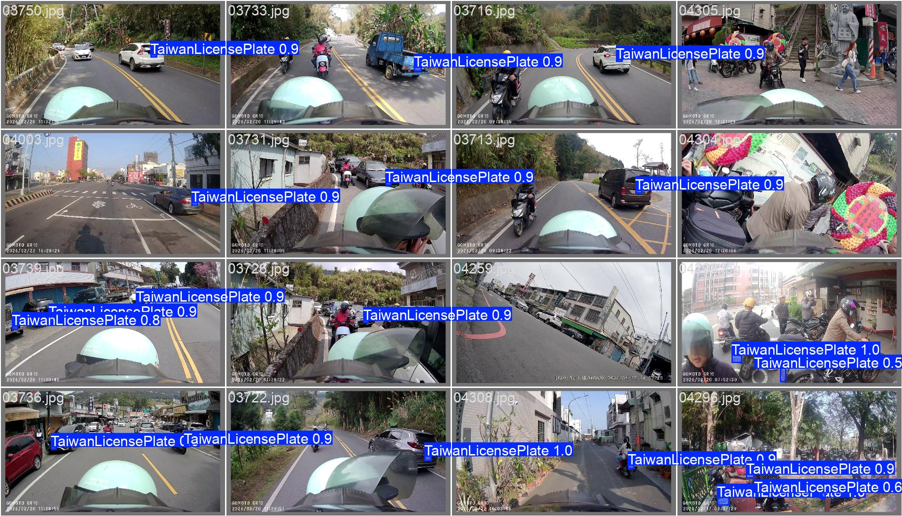

# Traffic Violation Reporting Automation (TVRA)

[中文版本](README.md)

This is a development project aimed at simplifying the traffic violation reporting process using AI image recognition and automated workflows. The project evolves from basic license plate and violation identification to a fully automated reporting system.

---

## Project Goals

| Phase | Goal |
|-------|------|
| Short-term | Achieve precise recognition of violations and license plates. |
| Mid-term | Integrate GPS positioning and geospatial information for semi-automated form filling. |
| Long-term | Establish a fully automated reporting pipeline adaptable to various hardware devices. |

---

## Roadmap and Technical Planning

### Phase 1: Foundation Recognition (Short-term)

Focus on Computer Vision (CV) model training and feature extraction.

- **Data Engineering**: Scrape/collect violation footage, perform data cleaning and labeling.
- **Automatic License Plate Recognition (ALPR)**: Develop recognition features to accurately extract license plate numbers.
- **Violation Detection**: Train models to identify specific violation types (e.g., running red lights, illegal turns, crossing solid lines).
- **Information Integration**: Automatically output structured data containing license plates, violation items, and timestamps.

### Phase 2: Location Mapping and Process Optimization (Mid-term)

Combine spatial information with automation scripts.

- **GPS Data Extraction**: Automatically read GPS coordinates embedded in dashcam footage.
- **Landmark Visual Recognition**: Identify road signs or buildings to determine locations when GPS data is missing.
- **Semi-automated Form Filling**: Automatically fill out regional traffic violation reporting web forms after human review.

### Phase 3: Comprehensive Adaptation and Full Automation (Long-term)

Enhance system compatibility and intelligence.

- **Multi-device Compatibility**: Adapt to major dashcam file formats and encodings on the market.
- **Multi-view Collaboration**: Automatically analyze and correlate footage from front and rear cameras to fully reconstruct violation events.
- **Fully Automated Screening**: The system automatically filters high-success-rate cases, enabling one-click or seamless reporting.

---

## Technology Stack

| Category | Technology |
|----------|------------|
| Language | Python 3.12 |
| Image Processing | OpenCV, YOLO (v26), PyTorch / TensorFlow |
| OCR | PaddleOCR |
| Automation | Selenium / Playwright (for web form filling) |
| Data Processing | Pandas, Custom Tools (FileCompareTool), NumPy, HDBSCAN, UMAP |

---

## Preliminary Results
Below are the prediction results automatically generated by the YOLO Segmentation model on the validation set, which can accurately locate license plates and violation features:

---

## Technical Documentation
For in-depth technical details regarding our automated sampling pipeline, please refer to:
- [Pipeline Technical Details (English)](./Tools/sampling/detail/SAMPLING_DETAILS_en.md)
- [Pipeline Technical Details (Chinese)](./Tools/sampling/detail/SAMPLING_DETAILS_zh.md)

The `Tools/sampling/` directory now functions as a broader data-engineering workbench, including:
- a multi-tab GUI workbench
- a shared service layer
- an Auto Label workflow
- multi-format annotation export for YOLO `.txt` and AnyLabel `.json`

---

## Current Progress
- **Current Status**: Reached version 5, currently testing the impact of different datasets on model performance.
- **Next Phase**: After extracting bounding boxes, implement OCR using OpenCV + PaddleOCR.

## Development Log
For detailed records of the development process, model version evolution, and technical challenges encountered, please refer to the standalone [Development Log (DEVELOPMENT_LOG_en.md)](./DEVELOPMENT_LOG_en.md).

---

## License

This project is licensed under the GNU Affero General Public License v3.0 (AGPL-3.0). See [.github/license.md](.github/license.md) for the full license text.

---

## Disclaimer
This project is for research and development purposes only. Users must comply with local laws and regulations. Malicious harassment or illegal use is strictly prohibited.

## How to Contribute
Contributions from developers of all levels are welcome! For detailed workflows, coding standards, and PR submission guidelines, please refer to our [Contributing Guide](.github/CONTRIBUTING.md).

If you have any questions, please contact me via email: qet6322076690@gmail.com
