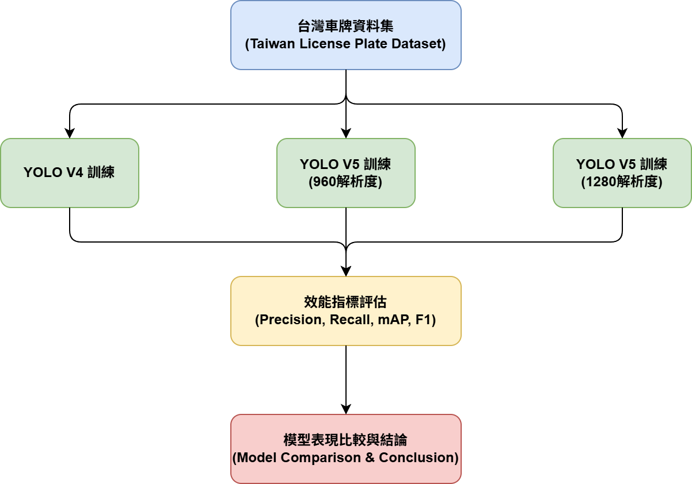

# Taiwan License Plate Detection Module (Technical Documentation)

[中文版本](README.md)

## 1. Overview
This folder (`TaiwanLicensePlate`) contains scripts and trained model results specifically for detecting license plates in Taiwan. To find the most suitable recognition model, this project has tested and compared 5 model versions, encompassing different resolutions and task types: **YOLO V4**, **YOLO V5 (960 resolution)**, **YOLO V5 (1280 resolution)**, and the latest **YOLO V5 (1280) Segmentation** model.

The folder mainly contains the following subdirectories:
* `CV2/`: Scripts for license plate image preprocessing and feature extraction.
* `YOLO/`: Contains test results and performance evaluation data of the detection models, used for model comparison and selection.

---

## 2. Model Evaluation Architecture

The following outlines the data processing and model evaluation workflow for this license plate detection module:

1. **Taiwan License Plate Dataset**: Input labeled dataset of Taiwan license plates.
2. **Model Training**: Feed the same dataset into YOLO V4 and YOLO V5 (including different resolutions) for training.
3. **Performance Metrics Evaluation**: Evaluate Precision, Recall, mAP50, mAP50-95, and F1 Score for each model's best weights (`best.pt`).
4. **Model Comparison & Conclusion**: Integrate and compare all model data to select the best-performing model for the final application.

---

## 3. Preliminary Results
Below are the prediction results automatically generated by the YOLO Segmentation model on the validation set, which can accurately locate license plates and violation features:

---

## 4. Performance Comparison

To ensure fairness, we compared the metrics at the Best Epoch where each model achieved its highest Fitness (comprehensive score).

| Model Name | Best Epoch | Precision | Recall | mAP50 | mAP50-95 | F1 Score |
| :--- | :---: | :---: | :---: | :---: | :---: | :---: |
| **YOLO V4** | 121 | 91.78% | 91.67% | 94.97% | 63.09% | 91.72% |
| **YOLO V5 (960) Run 1** | 178 | 91.64% | 95.76% | 97.04% | 86.53% | 93.65% |
| **YOLO V5 (960) Run 2** | 180 | 91.16% | **97.14%** | 96.46% | 82.56% | 94.13% |
| **YOLO V5 (1280)** | 181 | **95.10%** | 96.95% | 97.76% | 86.05% | **95.91%** |
| **YOLO V5 (1280) Seg** | 200 | 94.86% | 96.86% | **98.43%** | **90.02%** | 95.84% |

*(Note: F1 Score is calculated based on Precision and Recall: `2 * (P * R) / (P + R)`)*

---

## 5. Conclusion

1. **YOLO V4 vs YOLO V5**:
   Overall, the YOLO V5 series significantly outperforms YOLO V4 across all metrics. Notably, under the strict `mAP50-95` standard, YOLO V4's performance drops to 63.09%, while all YOLO V5 versions maintain over 82%. This indicates that YOLO V5 has a massive advantage in bounding box localization accuracy.

2. **Detection Model Performance**:
   * **YOLO V5 (1280)** achieved the best scores among detection models in **Precision (95.10%)** and **F1 Score (95.91%)**, making it suitable for scenarios requiring extreme accuracy.
   * **YOLO V5 (960) Run 2** performed exceptionally well in **Recall (97.14%)**, effectively reducing missed detections.

3. **Segmentation Model Breakthrough**:
   * **YOLO V5 (1280) Seg** matched the detection models in F1 Score but achieved breakthrough progress in **mAP50 (98.43%)** and **mAP50-95 (90.02%)**.
   * An `mAP50-95` above 90% means the model fits license plate shapes extremely well even under complex angles, lighting, or partial occlusion, providing much more stable boundary localization.

**Final Recommendation**:
Based on the latest data and comprehensive performance, we highly recommend using the **YOLO V5 (1280) Segment** model as the core recognition engine. Its outstanding `mAP50-95` metric demonstrates extremely high localization stability, and combined with semantic segmentation technology, it extracts license plate features much more precisely, making it the most ideal choice among the 5 versions.