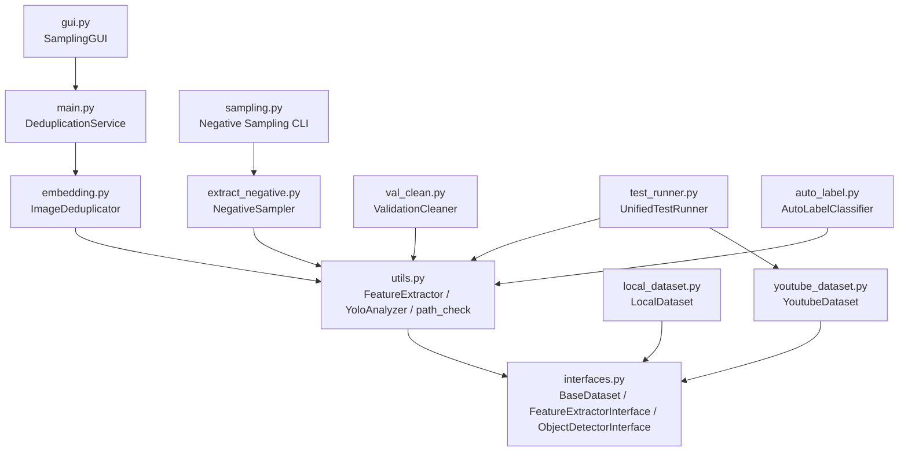
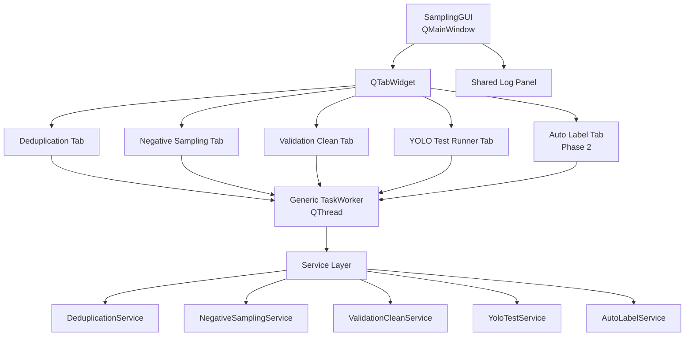

# Sampling 模組 Code Review 與 GUI 整合規劃

> Review 日期：2026-05-06  
> Review 範圍：`Tools/sampling/`  
> 目標：盤點 sampling 模組現況、指出設計與實作風險，並規劃如何把資料夾內主要功能整合進單一 GUI 工作台。

---

## 0. 已閱讀並遵守的規範與檔案

### 全域規範

- `C:/Users/qet63/Desktop/ClineGlobal/rules/agent.md`
- `C:/Users/qet63/Desktop/ClineGlobal/rules/flowchart_rule.md`
- `C:/Users/qet63/Desktop/ClineGlobal/role/py_role.md`

### 本次 Code Review 檢視檔案

- `Tools/sampling/gui.py`
- `Tools/sampling/main.py`
- `Tools/sampling/sampling.py`
- `Tools/sampling/embedding.py`
- `Tools/sampling/utils.py`
- `Tools/sampling/extract_negative.py`
- `Tools/sampling/auto_label.py`
- `Tools/sampling/val_clean.py`
- `Tools/sampling/test_runner.py`
- `Tools/sampling/local_dataset.py`
- `Tools/sampling/youtube_dataset.py`
- `Tools/sampling/interfaces.py`
- `Tools/sampling/CODE_REVIEW_AND_FIX_PLAN.md`

---

## 1. Executive Summary

目前 `Tools/sampling/` 已經不只是單純的圖片去重工具，而是包含以下多個資料工程與模型輔助流程：

1. 圖片去重：`main.py`、`embedding.py`
2. 負樣本抽樣：`sampling.py`、`extract_negative.py`
3. 驗證集清洗：`val_clean.py`
4. YOLO 推論測試：`test_runner.py`
5. YouTube 來源蒐集：`youtube_dataset.py`
6. 本地資料來源掃描：`local_dataset.py`
7. Auto-label 候選分群：`auto_label.py`
8. GUI：`gui.py`

但目前 GUI 僅包裝「圖片去重」流程，尚未形成完整 sampling 工作台。整體狀態可以歸納為：

- **核心功能已存在，但分散在 CLI-first 腳本中。**
- **GUI 覆蓋率不足，目前更接近 Dedup GUI，而不是 Sampling GUI。**
- **部分 UI 參數尚未真正接到後端邏輯。**
- **副檔名支援、路徑驗證、進度回報與 logging 規格仍不一致。**
- **若要擴充 GUI，應先 service 化，再整合為多頁式 GUI。**

---

## 2. 現有模組架構圖



---

## 3. 功能覆蓋盤點

| 功能 | 主要檔案 | 目前是否有 GUI | 狀態 |
|---|---|---:|---|
| 圖片去重 | `main.py`, `embedding.py` | 有 | 已整合，但參數接線不完整 |
| 負樣本抽樣 | `sampling.py`, `extract_negative.py` | 無 | CLI-only，適合整合成 GUI tab |
| 驗證集清洗 | `val_clean.py` | 無 | CLI-only，適合整合成 GUI tab |
| YOLO 推論測試 | `test_runner.py` | 無 | CLI-only，適合整合成 GUI tab |
| YouTube 來源測試 | `youtube_dataset.py`, `test_runner.py` | 無 | 可整合，但需注意 Selenium / yt-dlp 依賴與耗時 |
| 本地資料掃描 | `local_dataset.py` | 無 | 可作為 GUI 檔案來源輔助功能 |
| Auto-label 候選分群 | `auto_label.py` | 無 | 目前缺少候選資料建立流程，建議第二階段整合 |

---

## 4. Code Review Findings

### CR-001 Critical：GUI 的 `sample_way` 參數目前未生效

**位置**

- `Tools/sampling/gui.py`
- `Tools/sampling/main.py`

**問題描述**

GUI 中有建立取樣方式欄位：

```python
self.sample_way_combo = QComboBox()
self.sample_way_combo.addItems(["negative", "positive"])
```

但 `start_deduplication()` 沒有把該值傳入 `DeduplicationWorker`，而 `DeduplicationService.execute()` 內部寫死：

```python
sample_way="negative"
```

**影響**

- 使用者在 GUI 選擇 `positive` 不會改變實際行為。
- GUI 顯示與後端邏輯不一致，容易造成資料處理結果誤判。

**建議修正**

1. `DeduplicationWorker` 增加 `sample_way` 參數。
2. `DeduplicationService.execute()` 增加 `sample_way: str = "negative"`。
3. `ImageDeduplicator.process_batch()` 使用 GUI 傳入值。
4. 對 `sample_way` 做 enum / whitelist 驗證。

---

### CR-002 High：GUI 目前只包 dedup，未覆蓋 sampling 資料夾主要功能

**位置**

- `Tools/sampling/gui.py`
- `Tools/sampling/sampling.py`
- `Tools/sampling/val_clean.py`
- `Tools/sampling/test_runner.py`
- `Tools/sampling/auto_label.py`

**問題描述**

`gui.py` 目前只有一個主流程：

```python
DeduplicationWorker -> DeduplicationService.execute()
```

但資料夾內還有負樣本抽樣、驗證集清洗、YOLO 測試、Auto-label 分群等功能未整合。

**影響**

- 使用者仍需記憶多個 CLI 指令。
- GUI 沒有發揮工具整合入口的價值。
- 後續維護時容易出現 CLI 與 GUI 行為分歧。

**建議修正**

將 GUI 重構成 `QTabWidget` 多頁式工作台：

1. `Deduplication` tab
2. `Negative Sampling` tab
3. `Validation Clean` tab
4. `YOLO Test Runner` tab
5. `Auto Label` tab（第二階段或 placeholder）

---

### CR-003 High：CLI-first 腳本尚未 service 化，直接整進 GUI 會導致耦合擴大

**位置**

- `sampling.py`
- `val_clean.py`
- `test_runner.py`
- `gui.py`

**問題描述**

多數功能目前是 CLI entrypoint 設計，核心流程與 argparse / logging / file validation 混在同一檔案。

**影響**

- GUI 若直接呼叫 CLI main，會難以傳遞 progress callback。
- 錯誤處理與使用者訊息不容易標準化。
- 不利測試。

**建議修正**

建立或整理 service 層，例如：

```text
Tools/sampling/services.py
├── DeduplicationService
├── NegativeSamplingService
├── ValidationCleanService
└── YoloTestService
```

CLI 與 GUI 都呼叫 service，而不是 GUI 呼叫 CLI。

---

### CR-004 High：副檔名支援規格不一致

**位置**

- `main.py`
- `utils.py`
- `local_dataset.py`
- `extract_negative.py`
- `val_clean.py`

**問題描述**

不同檔案支援格式不同：

- `main.py` 支援 `.jpg`, `.jpeg`, `.png`, `.bmp`, `.webp`
- `utils.path_check()` 支援 `.jpg`, `.jpeg`, `.png`, `.bmp`
- `local_dataset.py` 支援影片與圖片，但不含 `.webp`
- `extract_negative.py` 與 `val_clean.py` 依賴 `path_check()`，因此也不支援 `.webp`

**影響**

- GUI 顯示可以處理的資料，和底層實際能處理的資料可能不同。
- 同一資料夾在不同功能 tab 下會得到不同結果。

**建議修正**

建立集中常數，例如：

```python
SUPPORTED_IMAGE_EXTENSIONS = {".jpg", ".jpeg", ".png", ".bmp", ".webp"}
SUPPORTED_VIDEO_EXTENSIONS = {".mp4", ".avi", ".mov", ".ts"}
```

並讓所有模組共用。

---

### CR-005 Medium：`gui.py` 匯入方式對執行位置敏感

**位置**

- `Tools/sampling/gui.py`

**問題描述**

目前使用：

```python
from main import DeduplicationService
```

此方式依賴目前工作目錄或 Python path，從專案根目錄、IDE、或 package 方式執行時可能出現 import error。

**建議修正**

改成可兼容 package 與 script 執行的匯入策略，或統一以模組方式執行：

```bash
python -m Tools.sampling.gui
```

搭配：

```python
from .main import DeduplicationService
```

若仍需支援直接執行 `python gui.py`，可加入 fallback import。

---

### CR-006 Medium：`embedding.py` 寫入策略與計算流程仍混在同一方法

**位置**

- `Tools/sampling/embedding.py`

**問題描述**

`ImageDeduplicator.process_batch()` 同時負責：

1. YOLO 分析排序
2. 特徵擷取
3. 相似度矩陣計算
4. dedup index 選擇
5. per-folder / per-video / per-frame 檔案寫入

雖然目前已保留 PyTorch 批次矩陣運算優勢，但 method responsibility 過重。

**影響**

- 未來 GUI 想顯示更細粒度進度時不容易拆。
- 寫入策略擴充會污染 dedup 核心邏輯。

**建議修正**

拆成：

- `extract_valid_embeddings()`
- `calculate_keep_indices()`
- `write_dedup_results()`
- `group_by_video_name()`

---

### CR-007 Medium：Progress callback 語意不一致

**位置**

- `embedding.py`
- `utils.py`
- `gui.py`
- `val_clean.py`
- `test_runner.py`

**問題描述**

不同模組的 progress callback 定義不完全一致，有些以圖片數為 total，有些以固定 100 為 total，有些完全沒有 callback。

**影響**

- GUI progress bar 只能顯示 busy state，難以顯示準確百分比。
- 多功能 GUI 化後，每個 tab 的體驗不一致。

**建議修正**

定義統一 callback protocol，例如：

```python
ProgressCallback = Callable[[int, int, str], None]
```

或建立 dataclass：

```python
@dataclass(frozen=True)
class ProgressEvent:
    current: int
    total: int
    message: str
```

---

### CR-008 Medium：`auto_label.py` 尚未具備完整 GUI 整合入口

**位置**

- `Tools/sampling/auto_label.py`

**問題描述**

`AutoLabelClassifier.cluster_and_select()` 需要 `candidates: List[Dict[str, Any]]`，但目前沒有看到 GUI 可直接建立 candidates 的來源流程。

**影響**

- 若直接整入 GUI，需要先定義候選資料格式、來源資料夾、標註資料夾與信心度欄位如何取得。

**建議修正**

第一階段可先不完整整合 Auto-label，改採：

- GUI 中建立 disabled / placeholder tab
- 或新增「從 JSON / CSV candidates 載入」的明確入口

---

### CR-009 Low：部分模組仍使用 `print()` 而非 logger

**位置**

- `auto_label.py`
- `youtube_dataset.py`

**問題描述**

`auto_label.py`、`youtube_dataset.py` 仍使用 `print()` 輸出狀態。若整合進 GUI，這些訊息不會自然進入 GUI log 面板。

**建議修正**

統一使用 `logging.getLogger(__name__)`。

---

### CR-010 Low：部分型別註解不足

**位置**

- `extract_negative.py`
- `auto_label.py`
- `gui.py`

**問題描述**

部分 method 參數與回傳值尚未完整 type hint，和 Python 角色規範中要求的現代 Python / type hint 標準仍有落差。

**建議修正**

逐步補齊：

- `Path | str` 型別
- `list[str]`
- `dict[str, Any]`
- `Optional[...]`
- GUI worker signal payload 註解

---

## 5. 建議目標 GUI 架構



---

## 6. GUI 整合建議功能表

### 6.1 Deduplication Tab

對應檔案：

- `main.py`
- `embedding.py`
- `utils.py`

必要 UI 欄位：

- Input folder
- Output folder
- Similarity threshold
- Sample way：`negative` / `positive`
- Write mode：`per-folder` / `per-video` / `per-frame`
- 啟用 YOLO confidence
- YOLO weights path

第一優先修正：讓 `sample_way` 真正接到後端。

---

### 6.2 Negative Sampling Tab

對應檔案：

- `sampling.py`
- `extract_negative.py`

必要 UI 欄位：

- Input folder
- Output folder
- Number of samples
- Temperature
- YOLO weights path

注意事項：

- `umap` / `hdbscan` 依賴需確認環境是否已安裝。
- 需要補圖片副檔名統一過濾。

---

### 6.3 Validation Clean Tab

對應檔案：

- `val_clean.py`

必要 UI 欄位：

- Source image folder
- Output dataset folder
- Confidence threshold
- YOLO weights path

輸出結構：

```text
output/
├── images/
└── labels/
```

---

### 6.4 YOLO Test Runner Tab

對應檔案：

- `test_runner.py`
- `youtube_dataset.py`

必要 UI 欄位：

- Source type：`video` / `image` / `file` / `youtube`
- Local path（source 非 youtube 時使用）
- YouTube count（source=youtube 時使用）
- Output folder
- Confidence threshold
- YOLO weights path

注意事項：

- YouTube / Selenium 流程耗時且依賴外部網路，GUI 需明確顯示狀態。
- 若網路或 ChromeDriver 失敗，必須用 message box 與 log 給出清楚錯誤。

---

### 6.5 Auto Label Tab（建議 Phase 2）

對應檔案：

- `auto_label.py`

暫不建議第一階段完整整合，原因：

- 目前 `candidates` 資料來源未標準化。
- GUI 需要先知道 candidate 的 `path`、`txt_path`、`name`、`max_conf` 從哪裡來。

可先做：

- Placeholder tab
- 或支援從 JSON / CSV 載入 candidates

---

## 7. 建議重構路線圖

### Phase 1：修正目前 GUI 與核心規格不一致

1. 修正 `sample_way` 未接線問題。
2. 建立共用副檔名常數。
3. 統一 `path_check()` 與各服務使用的圖片/影片過濾邏輯。
4. 統一 logging，不再使用 `print()`。
5. 補基本 type hints。

### Phase 2：Service 化 CLI-first 模組

1. 將負樣本抽樣包成 `NegativeSamplingService`。
2. 將驗證集清洗包成 `ValidationCleanService`。
3. 將 YOLO 測試包成 `YoloTestService`。
4. 保留原 CLI entrypoint，但改成呼叫 service。

### Phase 3：GUI 多頁整合

1. 將 `SamplingGUI` 改成 `QTabWidget`。
2. 建立共用路徑選擇 helper widget。
3. 建立 `GenericTaskWorker`，讓所有 tab 共用背景執行緒。
4. 所有任務共用 log handler 與 progress bar。

### Phase 4：UX 與穩定性補強

1. 執行期間鎖定目前 tab 的控制項。
2. 任務完成後顯示摘要。
3. 對缺少 YOLO 權重、錯誤路徑、空資料夾做一致化 warning。
4. 對長任務顯示可讀進度訊息。

---

## 8. 建議實作優先順序

| 優先級 | 工作項目 | 原因 |
|---:|---|---|
| P0 | 修正 `sample_way` 未接線 | GUI 顯示與實際行為不一致，屬正確性問題 |
| P0 | 統一副檔名常數與路徑檢查 | 避免不同功能處理結果不一致 |
| P1 | 建立 service layer | GUI 擴充前必要基礎 |
| P1 | 改造 GUI 為多 tab | 才能容納整個 sampling 資料夾功能 |
| P1 | 加入 Negative Sampling tab | 現有 CLI 功能完整，適合優先 GUI 化 |
| P1 | 加入 Validation Clean tab | 參數簡單、容易整合 |
| P2 | 加入 YOLO Test Runner tab | 功能重要，但 source 類型較多 |
| P3 | Auto-label tab | candidate 輸入格式需先定義 |

---

## 9. 驗收標準

後續若根據此 Code Review 進行實作，建議以下列條件驗收：

1. GUI 至少包含 Deduplication、Negative Sampling、Validation Clean、YOLO Test Runner 四個 tab。
2. GUI 中所有可設定欄位都會實際傳入後端 service。
3. CLI 原本的使用方式不被破壞。
4. 所有服務共用圖片/影片副檔名規格。
5. 所有長任務都在背景 thread 執行，不阻塞 GUI。
6. 所有任務 log 都會顯示在 GUI log panel。
7. 缺少權重、路徑不存在、空資料夾、無有效圖片等情況都有明確提示。

---

## 10. 結論

`Tools/sampling/` 已具備完整資料處理工具箱的雛形，但目前 GUI 僅整合去重功能，且存在 UI 參數未接線與規格不一致等問題。

建議不要直接在 `gui.py` 裡持續堆疊按鈕，而是採取以下策略：

1. **先修正現有 GUI 正確性問題。**
2. **把 CLI-first 功能抽成 service。**
3. **用 `QTabWidget` 建立多功能 sampling GUI。**
4. **最後補齊 progress、logging、錯誤提示與 UX。**

這樣可以讓 sampling 模組從「多個分散腳本」升級成「可維護的 GUI 資料工程工作台」。