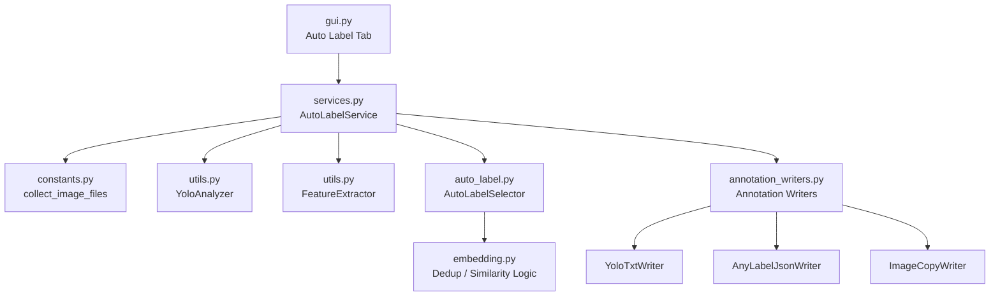
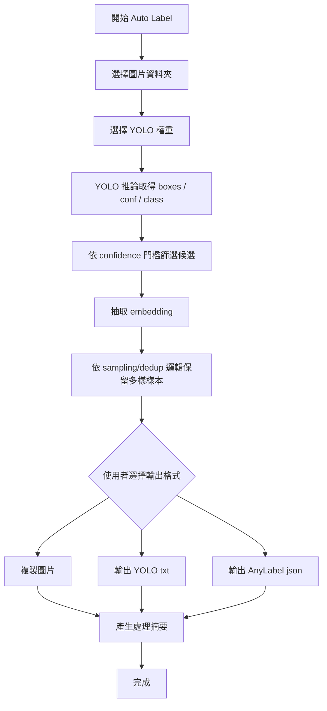

# Auto Label 與 Sampling 去重流程整合規劃

> 文件日期：2026-05-06  
> 文件目的：規劃 `auto_label.py` 如何從獨立候選分群腳本，改造成與 sampling / dedup 共用流程的 Auto Label 功能，並支援使用者選擇輸出 YOLO `.txt`、AnyLabel `.json` 或雙格式標註檔。

---

## 0. 已閱讀並遵守的規範與參考文件

### 全域規範

- `C:/Users/qet63/Desktop/ClineGlobal/rules/agent.md`
- `C:/Users/qet63/Desktop/ClineGlobal/rules/flowchart_rule.md`
- `C:/Users/qet63/Desktop/ClineGlobal/role/py_role.md`
- `C:/Users/qet63/Desktop/ClineGlobal/role/Tehcnical_role.md`

### 專案參考檔案

- `Tools/sampling/auto_label.py`
- `Tools/sampling/embedding.py`
- `Tools/sampling/services.py`
- `Tools/sampling/gui.py`
- `Tools/sampling/utils.py`
- `Tools/sampling/constants.py`
- `Tools/sampling/SAMPLING_CODE_REVIEW.md`
- `Tools/sampling/detail/SAMPLING_DETAILS_zh.md`
- `Tools/sampling/detail/SAMPLING_DETAILS_en.md`

---

## 1. 背景

目前 `Tools/sampling/auto_label.py` 的定位是：

- 對高信心度候選圖片做 K-Means 分群。
- 從每個群集中選出信心度最高的 Top-K 圖片。
- 複製圖片與對應 `.txt` 標註檔。

但它目前仍偏向獨立元件，和 sampling / dedup 主流程沒有完整結合。

使用者的新需求是：

> Auto Label 改成跟 sampling 去重一樣的邏輯即可，並整合進現有流程；使用者可決定是否輸出 YOLO `.txt` 或 AnyLabel `.json` 標註檔。

因此 Auto Label 的新定位應該從「獨立候選分群工具」改為：

> **Sampling workflow 的可選自動標註輸出階段。**

---

## 2. 目前 `auto_label.py` 的問題

### 2.1 Candidates 來源未標準化

目前 `cluster_and_select()` 需要：

```python
candidates: List[Dict[str, Any]]
```

每個 candidate 預期至少包含：

- `path`
- `name`
- `max_conf`
- `txt_path`（選填）

但目前沒有定義這些資料應該由哪個流程產生，也沒有 CLI / GUI 的標準入口。

### 2.2 特徵與 candidate 可能錯位

目前流程是：

```python
image_paths = [c["path"] for c in candidates]
features = self._feature_extractor.extract_features_from_paths(image_paths)
clusters = kmeans.fit_predict(features)
for idx, cluster_id in enumerate(clusters):
    cluster_groups[cluster_id].append(candidates[idx])
```

若某張圖片特徵抽取失敗，`features` 會少一筆，但 `candidates` 仍是原始長度，可能造成 cluster 結果對應到錯誤 candidate。

### 2.3 輸出副檔名寫死 `.jpg`

目前複製圖片時使用：

```python
dest_img = os.path.join(self._auto_images_dir, f"{cand['name']}.jpg")
```

這會讓 `.png`、`.jpeg`、`.webp` 等圖片被複製成 `.jpg` 檔名，但檔案內容未轉碼，副檔名與實際格式可能不一致。

### 2.4 缺少多格式標註輸出策略

目前只考慮 `.txt`，沒有 AnyLabel JSON writer，也沒有讓使用者選擇輸出格式。

### 2.5 不利 GUI 整合

目前使用 `print()`，缺少 service layer、logging、progress callback 與 GUI worker 整合。

---

## 3. 新目標

Auto Label 應改為與 sampling / dedup 共用同一套核心流程：

1. 共用 `constants.py` 的圖片副檔名與檔案蒐集規格。
2. 共用 `FeatureExtractor` 做 embedding。
3. 共用與 dedup 類似的去重 / 多樣性保留邏輯。
4. 共用 `services.py` 作為 GUI / CLI 的入口。
5. 共用 `gui.py` 的 `TaskWorker`、log panel、progress bar。
6. 使用者可以在 GUI 選擇輸出格式：
   - 只輸出圖片
   - 圖片 + YOLO `.txt`
   - 圖片 + AnyLabel `.json`
   - 圖片 + YOLO `.txt` + AnyLabel `.json`

---

## 4. 整合後的高階架構



---

## 5. 建議新流程



---

## 6. Auto Label 與 Sampling 去重邏輯的關係

### 6.1 目前 sampling / dedup 的核心概念

目前 dedup 主要做：

1. 收集圖片。
2. 抽 embedding。
3. 計算 cosine similarity matrix。
4. 根據 threshold 去除高度相似圖片。
5. 保留較多樣的圖片。

### 6.2 Auto Label 應如何沿用

Auto Label 可以沿用相同概念，但候選來源改成「YOLO 高信心度推論結果」。

建議流程：

1. 使用 YOLO 掃描圖片。
2. 只保留 `max_conf >= auto_label_threshold` 的圖片。
3. 對這些候選圖片抽 embedding。
4. 使用 dedup similarity threshold 去除場景過度相似圖片。
5. 可選：再用 K-Means / Top-K 做群內挑選。
6. 對保留圖片輸出標註檔。

### 6.3 建議是否保留 K-Means

建議保留為可選策略：

| 策略 | 說明 | 適用情境 |
|---|---|---|
| Dedup Only | 只用 similarity 去重 | 快速、結果可預期 |
| KMeans Top-K | 分群後每群取 Top-K | 希望場景更多樣 |
| Dedup + KMeans | 先去重再分群挑選 | 大量資料且要高品質候選 |

GUI 可先預設：

- `Dedup Only`

後續再開放：

- `Dedup + KMeans`

---

## 7. 資料結構設計

### 7.1 建議新增 dataclass

不要再使用裸 `dict[str, Any]` 傳遞 candidate，建議新增：

```python
from dataclasses import dataclass
from pathlib import Path


@dataclass(frozen=True)
class DetectionBox:
    class_id: int
    class_name: str
    confidence: float
    x_center: float
    y_center: float
    width: float
    height: float


@dataclass(frozen=True)
class AutoLabelCandidate:
    image_path: Path
    image_name: str
    image_width: int
    image_height: int
    max_confidence: float
    boxes: list[DetectionBox]
    embedding_index: int | None = None
```

### 7.2 為什麼要 dataclass

好處：

- 欄位明確。
- GUI / service / writer 共用同一份契約。
- 避免 `candidate["xxx"]` key 打錯。
- 比裸 dict 更容易測試。

---

## 8. 輸出格式規劃

本文件規劃的兩種主要標註輸出格式是：

- YOLO `.txt`
- AnyLabel `.json`

### 8.1 GUI 輸出選項

Auto Label tab 建議提供：

- [x] 複製圖片
- [ ] 輸出 YOLO txt
- [ ] 輸出 AnyLabel json

至少要允許以下組合：

| 複製圖片 | YOLO txt | AnyLabel json | 用途 |
|---:|---:|---:|---|
| 是 | 否 | 否 | 只挑圖人工檢查 |
| 是 | 是 | 否 | YOLO 訓練資料 |
| 是 | 否 | 是 | AnyLabel 人工修標 |
| 是 | 是 | 是 | 同時保留訓練與人工修標格式 |

---

### 8.2 YOLO `.txt` 格式

建議輸出位置：

```text
output/
├── images/
└── labels/
```

YOLO detection txt 格式：

```text
class_id x_center y_center width height
```

若需要保留 confidence，可提供選項：

```text
class_id x_center y_center width height confidence
```

建議 GUI 加上：

- [ ] YOLO txt 保留 confidence

---

### 8.3 AnyLabel `.json` 格式

專案目前沒有既有 AnyLabel JSON 實作，因此建議先定義內部 writer 介面，並把 AnyLabel schema 集中在單一 writer 中。

建議輸出位置：

```text
output/
├── images/
└── anylabel_json/
```

JSON 結構：

```json
{
  "version": "0.4.36",
  "flags": {},
  "shapes": [
    {
      "label": "plate",
      "text": "",
      "points": [
        [
          180.0,
          238.0
        ],
        [
          179.0,
          251.0
        ],
        [
          176.0,
          265.0
        ],
        [
          174.0,
          315.0
        ],
        [
          171.0,
          340.0
        ],
        [
          171.0,
          367.0
        ],
        [
          172.0,
          368.0
        ],
        [
          171.0,
          371.0
        ],
        [
          175.0,
          380.0
        ],
        [
          179.0,
          384.0
        ],
        [
          192.0,
          388.0
        ],
        [
          224.0,
          391.0
        ],
        [
          230.0,
          393.0
        ],
        [
          263.0,
          395.0
        ],
        [
          271.0,
          397.0
        ],
        [
          321.0,
          401.0
        ],
        [
          420.0,
          412.0
        ],
        [
          447.0,
          413.0
        ],
        [
          457.0,
          406.0
        ],
        [
          460.0,
          398.0
        ],
        [
          460.0,
          386.0
        ],
        [
          464.0,
          364.0
        ],
        [
          465.0,
          346.0
        ],
        [
          469.0,
          328.0
        ],
        [
          470.0,
          306.0
        ],
        [
          474.0,
          283.0
        ],
        [
          474.0,
          268.0
        ],
        [
          468.0,
          261.0
        ],
        [
          460.0,
          260.0
        ],
        [
          458.0,
          258.0
        ],
        [
          451.0,
          258.0
        ],
        [
          449.0,
          256.0
        ],
        [
          440.0,
          256.0
        ],
        [
          414.0,
          252.0
        ],
        [
          405.0,
          253.0
        ],
        [
          392.0,
          257.0
        ],
        [
          388.0,
          256.0
        ],
        [
          378.0,
          259.0
        ],
        [
          377.0,
          258.0
        ],
        [
          374.0,
          259.0
        ],
        [
          323.0,
          259.0
        ],
        [
          286.0,
          251.0
        ],
        [
          283.0,
          249.0
        ],
        [
          261.0,
          244.0
        ],
        [
          254.0,
          241.0
        ],
        [
          251.0,
          242.0
        ],
        [
          249.0,
          239.0
        ],
        [
          237.0,
          234.0
        ],
        [
          219.0,
          233.0
        ],
        [
          213.0,
          231.0
        ],
        [
          189.0,
          230.0
        ]
      ],
      "group_id": null,
      "shape_type": "polygon",
      "flags": {}
    }
  ],
  "imagePath": "00965.jpg",
  "imageData": null,
  "imageHeight": 640,
  "imageWidth": 640
}
```

> 注意：實作前需要確認 AnyLabel 實際使用的 JSON schema。如果 AnyLabel 採用 LabelMe 相容格式，欄位可能需要對齊 LabelMe 的 `version`、`flags`、`imageData`、`shapes` 等欄位。

---

## 9. Writer 抽象設計

建議新增：

- `Tools/sampling/annotation_writers.py`

概念如下：

```python
from abc import ABC, abstractmethod
from pathlib import Path


class AnnotationWriter(ABC):
    @abstractmethod
    def write(self, candidate: AutoLabelCandidate, output_root: Path) -> None:
        pass


class ImageCopyWriter(AnnotationWriter):
    def write(self, candidate: AutoLabelCandidate, output_root: Path) -> None:
        ...


class YoloTxtWriter(AnnotationWriter):
    def write(self, candidate: AutoLabelCandidate, output_root: Path) -> None:
        ...


class AnyLabelJsonWriter(AnnotationWriter):
    def write(self, candidate: AutoLabelCandidate, output_root: Path) -> None:
        ...
```

這樣未來若要新增：

- LabelMe JSON
- CVAT XML
- COCO JSON

只需要新增 writer，不需要改 Auto Label 主流程。

---

## 10. Service 設計

建議在 `services.py` 新增：

```python
class AutoLabelService:
    def execute(
        self,
        input_folder: Path,
        output_folder: Path,
        yolo_weights: str,
        confidence_threshold: float,
        similarity_threshold: float,
        output_yolo_txt: bool,
        output_anylabel_json: bool,
        copy_images: bool = True,
        keep_confidence: bool = False,
    ) -> list[AutoLabelCandidate]:
        ...
```

### 10.1 Service 負責事項

`AutoLabelService` 應負責：

1. 收集圖片。
2. 執行 YOLO 推論。
3. 建立 `AutoLabelCandidate`。
4. 過濾低信心度候選。
5. 執行 dedup / similarity selection。
6. 呼叫 writers 輸出圖片與標註檔。
7. 回傳最終保留 candidates。

---

## 11. GUI 設計

目前 `gui.py` 已有 Auto Label placeholder，後續可改成正式 tab。

### 11.1 Auto Label tab 欄位

建議欄位：

#### 路徑設定

- 輸入圖片資料夾
- 輸出資料夾
- YOLO 權重路徑

#### 篩選參數

- Auto-label confidence threshold
- Similarity threshold
- Top-K per cluster（如果啟用 KMeans）
- Max clusters（如果啟用 KMeans）

#### 策略

- 選擇策略：
  - Dedup Only
  - KMeans Top-K
  - Dedup + KMeans

#### 輸出格式

- [x] 複製圖片
- [ ] 輸出 YOLO txt
- [ ] 輸出 AnyLabel json
- [ ] YOLO txt 保留 confidence

---

## 12. 建議輸出資料夾結構

```text
auto_label_output/
├── images/
│   ├── 00001.jpg
│   └── 00002.jpg
├── labels/
│   ├── 00001.txt
│   └── 00002.txt
├── anylabel_json/
│   ├── 00001.json
│   └── 00002.json
└── auto_label_report.json
```

### 12.1 報告檔

建議輸出：

- `auto_label_report.json`

內容包含：

- 原始圖片數量
- YOLO 有偵測圖片數量
- 高信心候選數量
- 去重後保留數量
- 實際輸出圖片數量
- 實際輸出 txt 數量
- 實際輸出 json 數量
- 使用參數紀錄

---

## 13. 實作階段規劃

### Phase 1：資料結構與 writer

- 新增 `AutoLabelCandidate` dataclass。
- 新增 `DetectionBox` dataclass。
- 新增 `annotation_writers.py`。
- 實作 `ImageCopyWriter`。
- 實作 `YoloTxtWriter`。
- 實作 `AnyLabelJsonWriter`。

### Phase 2：Auto Label service

- 新增 `AutoLabelService`。
- 串接 `collect_image_files()`。
- 串接 `YoloAnalyzer`。
- 串接 embedding / dedup selection。
- 呼叫 writers 產生輸出。

### Phase 3：GUI 整合

- 將 Auto Label placeholder 改成正式 tab。
- 加入輸入/輸出/YOLO 權重欄位。
- 加入 confidence threshold / similarity threshold。
- 加入輸出格式 checkbox。
- 使用既有 `TaskWorker` 執行。

### Phase 4：驗證

- 驗證只輸出圖片。
- 驗證圖片 + YOLO txt。
- 驗證圖片 + AnyLabel json。
- 驗證圖片 + txt + json。
- 驗證壞圖 / 空資料夾 / 無偵測結果。

---

## 14. 驗收標準

完成實作後，應符合：

1. Auto Label 不再依賴裸 `dict[str, Any]` candidates。
2. Auto Label 與 sampling / dedup 共用圖片蒐集與副檔名規格。
3. Auto Label 能依信心度門檻篩選 YOLO 高信心候選。
4. Auto Label 能使用 similarity threshold 去除相似圖片。
5. GUI 可選擇輸出 YOLO `.txt`。
6. GUI 可選擇輸出 AnyLabel `.json`。
7. GUI 可選擇同時輸出 `.txt` 與 `.json`。
8. 圖片副檔名需保留原始格式，不可硬寫 `.jpg`。
9. 長任務不可阻塞 GUI。
10. 任務完成後需有 log 與 report 可追蹤結果。

---

## 15. 風險與待確認事項

### 15.1 AnyLabel JSON schema

目前專案內沒有 AnyLabel JSON 的既有實作，因此實作前需確認：

- AnyLabel 是否使用 LabelMe 相容格式。
- rectangle 的 points 格式。
- 是否需要 `imageData`。
- 是否需要 `version` / `flags` 欄位。

-- response:我已經將json格式貼入了

### 15.2 YOLO task 類型

目前 `YoloAnalyzer` 使用 `task="detect"`。

若未來 Auto Label 要支援 segmentation polygon，則 writer 需要支援：

- bbox
- polygon
- mask to polygon

目前第一版建議先支援 bbox。

### 15.3 Confidence 寫入格式

YOLO 訓練標準 txt 通常不包含 confidence。

若輸出給人工檢查，可保留 confidence。

因此建議做成 GUI 選項。

---

## 16. 結論

Auto Label 應改造成 sampling workflow 的延伸階段，而不是維持獨立候選分群腳本。

建議最終架構為：

1. 使用 YOLO 產生高信心候選。
2. 使用 sampling / dedup 類似邏輯保留多樣圖片。
3. 使用 writer 抽象化輸出圖片、YOLO txt、AnyLabel json。
4. 在 GUI 內讓使用者自由選擇輸出格式。

這樣可以讓 Auto Label 與現有 sampling GUI 工作台一致，並且保留未來擴充 LabelMe、CVAT、COCO 等格式的彈性。