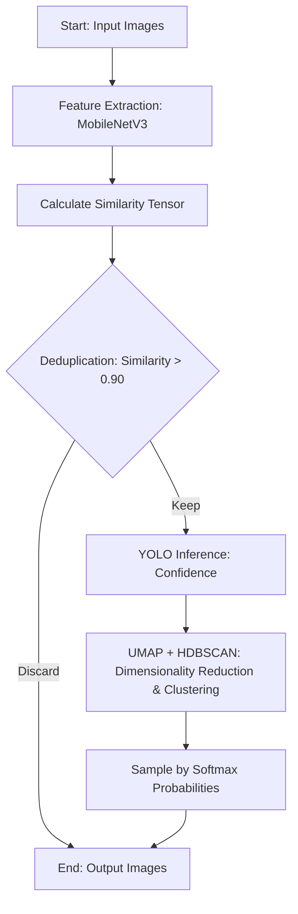

# Sampling Module Implementation Details

## Overview

The core purpose of the Sampling module is to automate the filtering and cleaning of large amounts of redundant images extracted from dashcams, and to perform high-quality negative sampling, validation set cleaning, and auto-labeling. The refactored version (`Tools/sampling/`) modularizes all functionality, unifies image processing with PIL, and supports parameterized execution via CLI.

This module includes the following core tools:
- **Image Deduplication** (`main.py` + `embedding.py`): Cosine similarity deduplication based on MobileNetV3 feature vectors
- **Negative Sampling** (`sampling.py` + `extract_negative.py`): UMAP + HDBSCAN clustering + Softmax probability sampling
- **Validation Set Cleaning** (`val_clean.py`): YOLO confidence threshold filtering + automatic label output
- **Auto Label Classification** (`auto_label.py`): K-Means clustering + Top-K selection
- **Data Acquisition** (`youtube_dataset.py`, `local_dataset.py`): YouTube scraping and local file scanning
- **Unified Test Runner** (`test_runner.py`): Supports YouTube/video/image/single file testing

## Algorithm Workflow

This module involves two main stages: image deduplication and sampling. The workflow is as follows:



## Core Technical & Architectural Improvements

### 1. Shared Logic Extraction (`utils.py`)
- **Feature Extraction & Inference Encapsulation**: Extracted the loading and feature extraction of MobileNetV3 (`FeatureExtractor`) and the inference wrapper for the YOLO model (`YoloAnalyzer`).
- **Automatic GPU Acceleration**: All neural network computations automatically detect and utilize the GPU (`cuda`) to enhance processing speed.
- **Exception Handling**: Added a safe image reading mechanism (`safe_image_open`) to ensure that corrupt images are skipped with a warning rather than causing the program to crash.
- **Batch Processing Support**: `FeatureExtractor` now includes `extract_features_from_paths()` for batch feature extraction.

### 2. OOM and Performance Bottleneck Resolution (`embedding.py`)
- Upgraded the similarity matrix calculation from `np.dot` to PyTorch's Tensor operations (`torch.mm`).
- This enables large matrix multiplications to be executed directly on the GPU, drastically improving performance during bulk image deduplication and preventing Out-Of-Memory (OOM) errors.

### 3. Data Acquisition Module (`youtube_dataset.py`, `local_dataset.py`)
- **YouTube Streaming**: Instead of downloading entire videos, the module uses `yt-dlp` to extract direct stream URLs, avoiding the common "Waiting for stream 0" issue and significantly reducing disk usage.
- **YouTube Scraper**: Uses Selenium to automatically scroll and scrape video links from a specified channel.
- **Local File Scanning**: `LocalDataset` supports scanning video (mp4/avi/mov/ts) and image (jpg/jpeg/png) files in a directory.

### 4. Inference and Extraction Strategy
- **5 FPS Strategy**: Processes video streams at 5 frames per second using OpenCV, ensuring sufficient coverage of traffic events while avoiding excessive redundant data.
- **Confidence Filtering**: Detections are categorized based on their maximum confidence score:
  - **Auto Labeled (`max_conf >= 0.8`)**: High-confidence frames are candidates for automated labeling.
  - **Negative Sample (`0.2 < max_conf < 0.65`)**: Hard negative candidates that deceive the model.
- **Temporal Spacing (3-Second Rule)**: A 3-second (15 processed frames) interval is strictly enforced to prevent the candidate pool from being dominated by near-identical consecutive frames.
- **Disk-Backed Temporary Storage**: Candidate frames are saved to disk immediately, keeping only metadata in RAM to prevent OOM.

### 5. Auto Label Classification (`auto_label.py`)
- Applies K-Means clustering to high-confidence candidates, selecting Top-K samples per cluster to ensure scene diversity.
- Can be used independently to scan any image folder and produce a high-quality, diverse dataset.

## CLI Commands

All scripts have removed hardcoded paths and now rely on `argparse` for dynamic parameter input. Use the `-h` flag for detailed usage instructions.

### Image Deduplication (`main.py`)
Filters highly similar redundant images based on image features or YOLO confidence.
```bash
python sampling/main.py \
    --input_folder "Path to your original image folder" \
    --output_folder "Output path for deduplicated images" \
    --threshold 0.90 \
    --yolo_weights "Path to your best weights file (best.pt)" \
    --use_confidence
```
*(If you do not need to deduplicate based on YOLO confidence, you can omit `--use_confidence` and `--yolo_weights`)*

### Negative Sampling (`sampling.py`)
Utilizes UMAP for dimensionality reduction and HDBSCAN for clustering, then converts the average YOLO confidence of each cluster into a sampling probability to extract a specified number of negative samples.
```bash
python sampling/sampling.py \
    --input_folder "Path to deduplicated image folder" \
    --output_folder "Output path for sampled results" \
    --num_samples 400 \
    --yolo_weights "Path to your best weights file (best.pt)" \
    --temperature 5.0
```

### Validation Set Cleaning (`val_clean.py`)
Filters images based on a YOLO confidence threshold (default 0.6) and automatically creates corresponding YOLO format `images` and `labels` annotation files.
```bash
python sampling/val_clean.py \
    --source_path "Source image folder path" \
    --out_path "Output folder path for cleaned images" \
    --yolo_weights "Path to your best weights file (best.pt)" \
    --threshold 0.6
```

### Unified Test Runner (`test_runner.py`)
A versatile YOLO inference test tool supporting multiple source types, replacing the original `test.py`.
```bash
# Test local video folder
python test_runner.py --source video --path ./test_video --yolo_weights best.engine

# Test local image folder
python test_runner.py --source image --path ./test_images --yolo_weights best.engine

# Test YouTube stream
python test_runner.py --source youtube --count 5 --yolo_weights best.engine

# Test single file
python test_runner.py --source file --path ./test.mp4 --yolo_weights best.engine
```

### Data Acquisition Modules (Programmatic Usage)
```python
from youtube_dataset import YoutubeDataset
dataset = YoutubeDataset(target_count=200)
sources = dataset.get_sources()  # Returns list of YouTube video URLs

from local_dataset import LocalDataset
dataset = LocalDataset("./test_video")
sources = dataset.get_sources()  # Returns list of local file paths
```

## Module Dependencies

```
test_runner.py
  ├── youtube_dataset.py   ← YouTube testing
  ├── local_dataset.py     ← Local video/image testing
  └── YOLO (direct ultralytics usage)

embedding.py + main.py     ← Deduplication tool (standalone)
  └── utils.py

sampling.py                ← Negative sampling tool (standalone)
  └── extract_negative.py + utils.py

val_clean.py               ← Validation set cleaning (standalone)
  └── YOLO (direct ultralytics usage)

auto_label.py              ← Auto Label classification (standalone or importable)
  └── utils.py