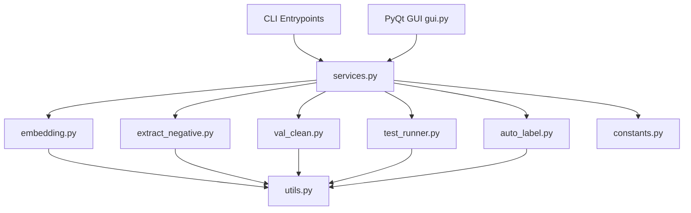
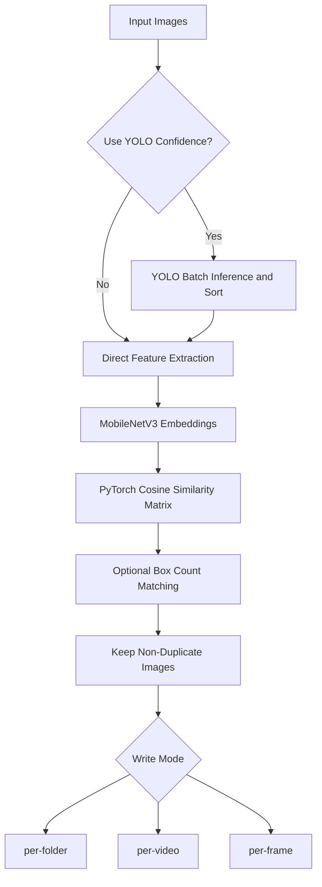
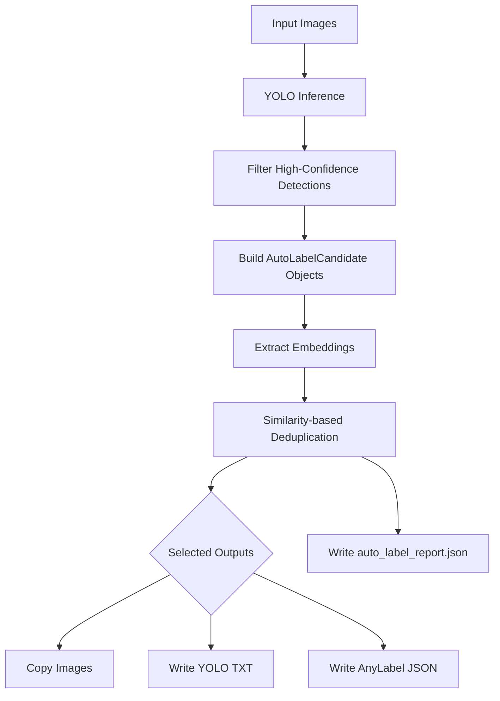

# Sampling Module Implementation Details

## Overview

The `Tools/sampling/` directory has evolved from a loose collection of scripts into a data-engineering workbench for TVRA. It is responsible for:

- removing redundant dashcam frames
- mining useful negative samples
- cleaning validation sets and exporting YOLO labels
- running YOLO testing workflows for images, videos, single files, and YouTube sources
- generating high-confidence Auto Label outputs

The current implementation is organized around three layers:

1. **CLI entrypoints**: `main.py`, `sampling.py`, `val_clean.py`, and `test_runner.py`
2. **Shared workflow services**: `services.py`
3. **A PyQt multi-tab GUI workbench**: `gui.py`

This means the module is no longer best described as a single deduplication utility. It now provides reusable workflow services plus an interactive GUI workbench.

## Current Core Tools

- **Image Deduplication** (`main.py` + `embedding.py` + `services.py`)
  - MobileNetV3 embedding extraction
  - cosine-similarity deduplication
  - optional YOLO-confidence ordering and box-count matching
  - `per-folder`, `per-video`, and `per-frame` write modes
- **Negative Sampling** (`sampling.py` + `extract_negative.py` + `services.py`)
  - UMAP dimensionality reduction
  - HDBSCAN clustering
  - temperature-controlled Softmax sampling probabilities
- **Validation Set Cleaning** (`val_clean.py` + `services.py`)
  - YOLO confidence-threshold filtering
  - cleaned `images/` and `labels/` dataset export
- **YOLO Test Workflows** (`test_runner.py` + `services.py`)
  - image / video / file / YouTube testing
- **Auto Label Workflow** (`auto_label.py` + `services.py` + `gui.py`)
  - YOLO high-confidence candidate building
  - embedding-similarity deduplication
  - optional image / YOLO `.txt` / AnyLabel JSON export
  - `auto_label_report.json` generation
- **GUI Workbench** (`gui.py`)
  - unified multi-tab workbench covering all major workflows

## Architecture Snapshot



## Workflow Summary

### 1. Image Deduplication



### 2. Auto Label Workflow



## Core Technical Improvements

### 1. Shared Logic Extraction (`utils.py`, `constants.py`, `services.py`)

- `FeatureExtractor` encapsulates MobileNetV3 feature extraction.
- `YoloAnalyzer` encapsulates YOLO inference and defaults to `stream=True` to reduce OOM risk.
- `safe_image_open()` protects workflows from corrupt image crashes.
- `constants.py` centralizes supported image/video extensions and file collection helpers.
- `services.py` unifies GUI and future CLI/API workflow invocation.
- Most modules now support both package execution and script execution imports:
  - `python -m Tools.sampling.gui`
  - `python Tools/sampling/gui.py`

### 2. OOM and Performance Improvements (`embedding.py`)

- Similarity matrix computation was moved from `np.dot` style processing to PyTorch tensor operations using `torch.mm`.
- This allows larger matrix multiplications on GPU and reduces memory bottlenecks during deduplication.
- Optional box-count matching prevents visually similar images with different object counts from being incorrectly removed.

### 3. Service Layer (`services.py`)

The current service layer contains:

- `DeduplicationService`
- `NegativeSamplingService`
- `ValidationCleanService`
- `YoloTestService`
- `AutoLabelService`

The GUI no longer needs to embed all low-level workflow logic directly. Instead, it invokes shared services, making CLI / GUI / future API integration easier to maintain.

### 4. GUI Workbench (`gui.py`)

The correct GUI version is a **multi-tab data-engineering workbench**, not the early single-purpose dedup window.

The GUI currently contains tabs for:

- image deduplication
- negative sampling
- validation set cleaning
- YOLO testing
- Auto Label

It also provides:

- shared background worker threads (`TaskWorker`)
- progress callbacks
- a unified logging panel
- reusable path-row helpers
- logging bridge cleanup to avoid Qt-backed logging handler shutdown errors

### 5. Auto Label Workflow (`auto_label.py`)

The current Auto Label implementation is **not** the older K-Means / Top-K design.

Instead, it now uses:

- `DetectionBox` dataclass
- `AutoLabelCandidate` dataclass
- `AutoLabelSelector` for embedding-similarity deduplication
- `AutoLabelWorkflow` for YOLO candidate building, selection, output writing, and report generation

Supported writers:

- `ImageCopyWriter`
- `YoloTxtWriter`
- `AnyLabelJsonWriter`

Generated report:

- `auto_label_report.json`

> Note: `AutoLabelClassifier = AutoLabelSelector` remains as a backward-compatible alias for old imports, but current documentation and GUI behavior should refer to `AutoLabelWorkflow` / `AutoLabelService`.

## CLI Commands

All CLI-oriented scripts use `argparse` and should not depend on hardcoded paths.

### Image Deduplication (`main.py`)

```bash
python -m Tools.sampling.main \
    --input_folder "Path to original images" \
    --output_folder "Output path for deduplicated images" \
    --threshold 0.90 \
    --yolo_weights "best.pt" \
    --use_confidence \
    --write_mode per-folder
```

Without YOLO confidence ordering:

```bash
python -m Tools.sampling.main \
    --input_folder "Path to original images" \
    --output_folder "Output path for deduplicated images" \
    --threshold 0.90
```

### Negative Sampling (`sampling.py`)

```bash
python -m Tools.sampling.sampling \
    --input_folder "Path to deduplicated images" \
    --output_folder "Output path for sampled results" \
    --num_samples 400 \
    --yolo_weights "best.pt" \
    --temperature 5.0
```

### Validation Set Cleaning (`val_clean.py`)

```bash
python -m Tools.sampling.val_clean \
    --source_path "Source image folder" \
    --out_path "Output folder for cleaned dataset" \
    --yolo_weights "best.pt" \
    --threshold 0.6
```

### Unified Test Runner (`test_runner.py`)

```bash
python -m Tools.sampling.test_runner --source video --path ./test_video --yolo_weights best.engine
python -m Tools.sampling.test_runner --source image --path ./test_images --yolo_weights best.engine
python -m Tools.sampling.test_runner --source youtube --count 5 --yolo_weights best.engine
python -m Tools.sampling.test_runner --source file --path ./test.mp4 --yolo_weights best.engine
```

### GUI Launch

```bash
python -m Tools.sampling.gui
```

Script execution is also supported:

```bash
python Tools/sampling/gui.py
```

### Auto Label Programmatic Usage

At present, Auto Label is primarily exposed through the GUI and `AutoLabelService`:

```python
from pathlib import Path
from Tools.sampling.services import AutoLabelService

service = AutoLabelService(
    yolo_weights="best.pt",
    confidence_threshold=0.8,
    similarity_threshold=0.9,
)

selected = service.execute(
    input_folder=Path("./input_images"),
    output_folder=Path("./auto_label_output"),
    copy_images=True,
    output_yolo_txt=True,
    output_anylabel_json=True,
    keep_confidence=False,
)
```

## Module Dependencies

```text
gui.py
  └── services.py
      ├── DeduplicationService
      ├── NegativeSamplingService
      ├── ValidationCleanService
      ├── YoloTestService
      └── AutoLabelService

main.py
  └── embedding.py
      └── utils.py + constants.py

sampling.py
  └── extract_negative.py
      └── utils.py + constants.py

val_clean.py
  └── utils.py

test_runner.py
  ├── youtube_dataset.py
  ├── local_dataset.py
  └── utils.py

auto_label.py
  ├── AutoLabelWorkflow
  ├── AutoLabelSelector
  ├── DetectionBox / AutoLabelCandidate
  ├── ImageCopyWriter
  ├── YoloTxtWriter
  ├── AnyLabelJsonWriter
  └── utils.py + constants.py
```

## Current Notes

- If the working tree contains a single-purpose dedup-only `gui.py`, that file is an older version.
- The correct sampling GUI lineage is the multi-tab workbench version with `services.py` integration.
- Auto Label should be described as **YOLO candidate filtering + embedding similarity deduplication + multi-format export**, not K-Means / Top-K classification.
- Documentation, GUI, service layer, and `auto_label.py` must be maintained together to avoid exposing GUI features whose service imports do not exist.
