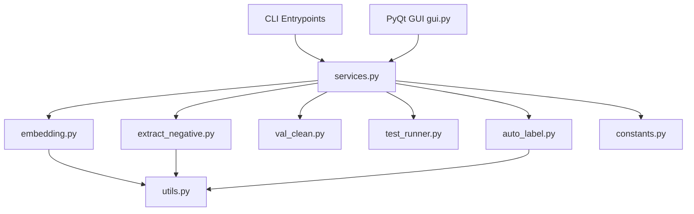
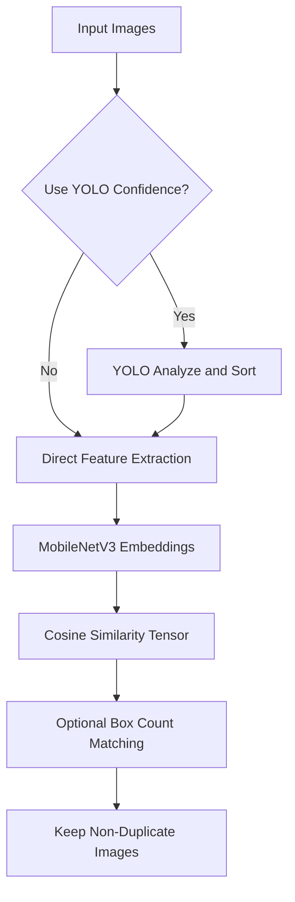
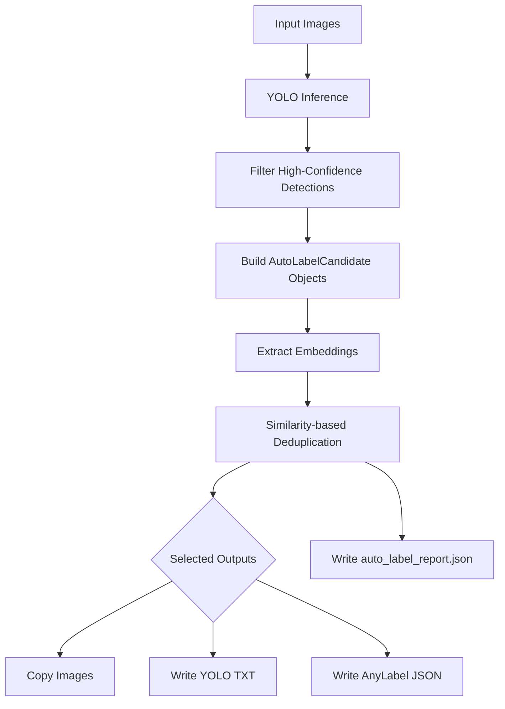

# Sampling Module Implementation Details

## Overview

The `Tools/sampling/` directory has evolved from a loose collection of scripts into a data-engineering workbench for TVRA. Its responsibilities now include:

- removing redundant dashcam frames
- mining useful negative samples
- cleaning validation sets
- running YOLO testing workflows
- generating high-confidence auto-label outputs

The current implementation is organized around three layers:

1. **CLI entrypoints** such as `main.py`, `sampling.py`, `val_clean.py`, and `test_runner.py`
2. **Shared workflow services** in `services.py`
3. **A PyQt GUI workbench** in `gui.py`

This means the module is no longer best described as a set of standalone utilities only. It now provides reusable workflow services plus a multi-tab GUI for interactive operation.

### Current Core Tools

- **Image Deduplication** (`main.py` + `embedding.py` + `services.py`)
  - MobileNetV3 embedding extraction
  - cosine-similarity deduplication
  - optional YOLO-confidence ordering
- **Negative Sampling** (`sampling.py` + `extract_negative.py` + `services.py`)
  - UMAP dimensionality reduction
  - HDBSCAN clustering
  - temperature-controlled sampling probabilities
- **Validation Set Cleaning** (`val_clean.py` + `services.py`)
  - YOLO confidence threshold filtering
  - cleaned dataset export
- **YOLO Test Workflows** (`test_runner.py` + `services.py`)
  - image / video / file / YouTube testing
- **Auto Label Workflow** (`auto_label.py` + `services.py` + `gui.py`)
  - YOLO high-confidence candidate building
  - embedding-similarity deduplication
  - optional image / YOLO txt / AnyLabel JSON export
- **GUI Workbench** (`gui.py`)
  - unified multi-tab workbench covering all major workflows

## Architecture Snapshot



## Workflow Summary

### 1. Image Deduplication



### 2. Auto Label Workflow



## Core Technical Improvements

### 1. Shared Logic Extraction (`utils.py`, `constants.py`, `services.py`)
- `FeatureExtractor` encapsulates MobileNetV3 feature extraction.
- `YoloAnalyzer` encapsulates YOLO inference behavior.
- `safe_image_open()` protects workflows from corrupt image crashes.
- `constants.py` centralizes supported file extensions and file collection helpers.
- `services.py` unifies GUI and CLI workflow invocation.

### 2. OOM and Performance Improvements (`embedding.py`)
- Similarity matrix computation was moved from `np.dot` style processing to PyTorch tensor operations using `torch.mm`.
- This allows larger matrix multiplications on GPU and reduces memory bottlenecks during deduplication.

### 3. Service-layer Refactor (`services.py`)
The current service layer contains:
- `DeduplicationService`
- `NegativeSamplingService`
- `ValidationCleanService`
- `YoloTestService`
- `AutoLabelService`

This refactor is important because the GUI no longer calls low-level script logic directly.

### 4. GUI Workbench (`gui.py`)
The correct GUI version is a **multi-tab workbench**, not a single-purpose dedup window.

The GUI currently contains tabs for:
- image deduplication
- negative sampling
- validation set cleaning
- YOLO testing
- Auto Label

It also provides:
- shared task worker threads
- progress callbacks
- unified logging panel
- reusable path-row helpers

### 5. Auto Label Workflow (`auto_label.py`)
The current Auto Label implementation is **not** the older K-Means / Top-K design.

Instead, it now uses:
- `DetectionBox` dataclass
- `AutoLabelCandidate` dataclass
- `AutoLabelSelector` for embedding-similarity deduplication
- `AutoLabelWorkflow` for candidate building and export orchestration

Supported writers:
- `ImageCopyWriter`
- `YoloTxtWriter`
- `AnyLabelJsonWriter`

Generated report:
- `auto_label_report.json`

## CLI Commands

All CLI-oriented scripts use `argparse` and no longer depend on hardcoded paths.

### Image Deduplication (`main.py`)
```bash
python sampling/main.py \
    --input_folder "Path to your original image folder" \
    --output_folder "Output path for deduplicated images" \
    --threshold 0.90 \
    --yolo_weights "Path to your best weights file (best.pt)" \
    --use_confidence
```

### Negative Sampling (`sampling.py`)
```bash
python sampling/sampling.py \
    --input_folder "Path to deduplicated image folder" \
    --output_folder "Output path for sampled results" \
    --num_samples 400 \
    --yolo_weights "Path to your best weights file (best.pt)" \
    --temperature 5.0
```

### Validation Set Cleaning (`val_clean.py`)
```bash
python sampling/val_clean.py \
    --source_path "Source image folder path" \
    --out_path "Output folder path for cleaned images" \
    --yolo_weights "Path to your best weights file (best.pt)" \
    --threshold 0.6
```

### Unified Test Runner (`test_runner.py`)
```bash
python test_runner.py --source video --path ./test_video --yolo_weights best.engine
python test_runner.py --source image --path ./test_images --yolo_weights best.engine
python test_runner.py --source youtube --count 5 --yolo_weights best.engine
python test_runner.py --source file --path ./test.mp4 --yolo_weights best.engine
```

### Auto Label Workflow

At present, Auto Label is primarily exposed through:
- `AutoLabelService`
- the GUI workbench

Programmatic usage example:

```python
from pathlib import Path
from Tools.sampling.services import AutoLabelService

service = AutoLabelService(
    yolo_weights="best.pt",
    confidence_threshold=0.8,
    similarity_threshold=0.9,
)

selected = service.execute(
    input_folder=Path("./input_images"),
    output_folder=Path("./auto_label_output"),
    copy_images=True,
    output_yolo_txt=True,
    output_anylabel_json=True,
    keep_confidence=False,
)
```

GUI launch:

```bash
python -m Tools.sampling.gui
```

## Module Dependencies

```text
gui.py
  └── services.py
      ├── DeduplicationService
      ├── NegativeSamplingService
      ├── ValidationCleanService
      ├── YoloTestService
      └── AutoLabelService

main.py
  └── services.py
      └── embedding.py
          └── utils.py + constants.py

sampling.py
  └── services.py
      └── extract_negative.py
          └── utils.py + constants.py

val_clean.py
  └── services.py

test_runner.py
  ├── youtube_dataset.py
  ├── local_dataset.py
  └── YOLO inference support

auto_label.py
  ├── AutoLabelWorkflow
  ├── AutoLabelSelector
  ├── DetectionBox / AutoLabelCandidate
  ├── ImageCopyWriter
  ├── YoloTxtWriter
  ├── AnyLabelJsonWriter
  └── utils.py + constants.py
```

## Current Notes

- If your working tree contains a single-purpose dedup-only `gui.py`, that file is an older version.
- The correct sampling GUI lineage is the multi-tab workbench version with `services.py` integration.
- The current Auto Label workflow should be described as **YOLO candidate filtering + embedding similarity deduplication + multi-format export**, not K-Means / Top-K classification.