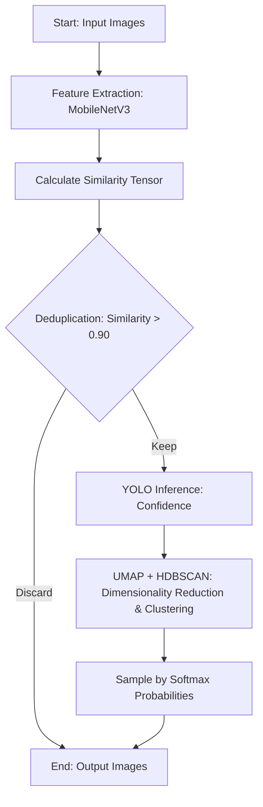

# Sampling Module Implementation Details

## Overview
The core purpose of the Sampling2 module is to automate the filtering and cleaning of large amounts of redundant images extracted from dashcams, and to perform high-quality negative sampling and validation set cleaning. The refactored version (`sampling/`) greatly optimizes performance and architecture by encapsulating feature extraction and model inference, improving similarity matrix calculations, and supporting parameterized execution via CLI.

## Algorithm Workflow

This module involves two main stages: image deduplication and sampling. The workflow is as follows:



## Core Technical & Architectural Improvements

### 1. Shared Logic Extraction (`utils.py`)
- **Feature Extraction & Inference Encapsulation**: Extracted the loading and feature extraction of MobileNetV3 (`FeatureExtractor`) and the inference wrapper for the YOLO model (`YoloAnalyzer`).
- **Automatic GPU Acceleration**: All neural network computations automatically detect and utilize the GPU (`cuda`) to enhance processing speed.
- **Exception Handling**: Added a safe image reading mechanism (`safe_image_open`) to ensure that corrupt images are skipped with a warning rather than causing the program to crash.

### 2. OOM and Performance Bottleneck Resolution (`embedding.py`)
- Upgraded the similarity matrix calculation from `np.dot` to PyTorch's Tensor operations (`torch.mm`).
- This enables large matrix multiplications to be executed directly on the GPU, drastically improving performance during bulk image deduplication and preventing Out-Of-Memory (OOM) errors.

### 3. Execution and Usage (CLI Commands)

All scripts have removed hardcoded paths and now rely on `argparse` for dynamic parameter input. Use the `-h` or `--help` flag for detailed usage instructions.

#### 3.1 Image Deduplication (`main.py`)
Filters highly similar redundant images based on image features or YOLO confidence.
```bash
python sampling/main.py \
    --input_folder "Path to your original image folder" \
    --output_folder "Output path for deduplicated images" \
    --threshold 0.90 \
    --yolo_weights "Path to your best weights file (best.pt)" \
    --use_confidence
```
*(If you do not need to deduplicate based on YOLO confidence, you can omit `--use_confidence` and `--yolo_weights`)*

#### 3.2 Negative Sampling (`sampling.py`)
Utilizes UMAP for dimensionality reduction and HDBSCAN for clustering, then converts the average YOLO confidence of each cluster into a sampling probability to extract a specified number of negative samples from the deduplicated images.
```bash
python sampling/sampling.py \
    --input_folder "Path to deduplicated image folder" \
    --output_folder "Output path for sampled results" \
    --num_samples 400 \
    --yolo_weights "Path to your best weights file (best.pt)" \
    --temperature 5.0
```

#### 3.3 Validation Set Cleaning (`val_clean.py`)
Filters images from a specified folder based on a given YOLO confidence threshold (default 0.6) and automatically creates corresponding YOLO format `images` and `labels` annotation files.
```bash
python sampling/val_clean.py \
    --source_path "Source image folder path" \
    --out_path "Output folder path for cleaned images" \
    --yolo_weights "Path to your best weights file (best.pt)" \
    --threshold 0.6
```
