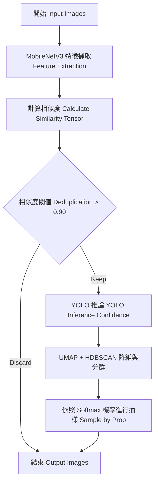

# Sampling 模組細節 (Sampling Module Implementation Details)

## 概述
Sampling1 模組的核心目的是自動化過濾與清洗行車紀錄器中擷取的大量重複圖片，並進行高質量的負樣本抽樣與驗證集清洗。重構後的版本 (`sampling/`) 大幅優化了效能與架構，將特徵擷取與模型推論封裝、改進相似度矩陣運算並支援 CLI 參數化執行。

## 演算法流程

本模組包含圖片去重與抽樣兩個主要階段，流程如下：



## 核心技術與架構改進

### 1. 抽離共用邏輯 (`utils.py`)
- **特徵擷取與推論封裝**：提取了 MobileNetV3 的載入與特徵擷取 (`FeatureExtractor`)，以及 YOLO 模型的推論封裝 (`YoloAnalyzer`)。
- **自動 GPU 加速**：所有神經網路運算都會自動偵測並使用 GPU (`cuda`) 以提升運算速度。
- **異常防護**：加入安全的圖片讀取機制 (`safe_image_open`)，確保遇到損壞的圖片時能跳過並發出警告，不中斷整體流程。

### 2. 解決 OOM 與效能瓶頸 (`embedding.py`)
- 將原本基於 `np.dot` 的相似度矩陣運算，升級為依賴 PyTorch 的 Tensor 運算 (`torch.mm`)。
- 這樣能讓大型矩陣相乘在 GPU 上直接執行，大幅改善大量圖片去重時的效能並避免記憶體溢出 (OOM)。

### 3. 工具使用方式 (CLI Commands)

所有腳本已去除硬編碼路徑 (Hardcoded Paths)，現在需透過 `argparse` 動態傳入參數。支援 `-h` 參數查詢詳細用法。

#### 3.1 圖片去重 (`main.py`)
依據影像特徵或 YOLO 信心度過濾高度相似的重複圖片。
```bash
python sampling/main.py \
    --input_folder "您的原始圖片資料夾路徑" \
    --output_folder "去重後的輸出路徑" \
    --threshold 0.90 \
    --yolo_weights "您的最佳權重檔(best.pt)路徑" \
    --use_confidence
```
*(如果不需依靠 YOLO 信心度去重，可省略 `--use_confidence` 及 `--yolo_weights`)*

#### 3.2 負樣本抽樣 (`sampling.py`)
利用 UMAP 降維與 HDBSCAN 分群，再根據各群 YOLO 平均信心度換算為抽樣機率，從去重後的圖片中抽取指定數量的負樣本。
```bash
python sampling/sampling.py \
    --input_folder "去重後的圖片資料夾路徑" \
    --output_folder "抽樣結果存放資料夾路徑" \
    --num_samples 400 \
    --yolo_weights "您的最佳權重檔(best.pt)路徑" \
    --temperature 5.0
```

#### 3.3 驗證集清洗 (`val_clean.py`)
根據指定的 YOLO 信心度閥值 (預設 0.6)，從特定資料夾中篩選圖片，並自動建立對應的 YOLO 格式 `images` 及 `labels` 標註檔案。
```bash
python sampling/val_clean.py \
    --source_path "來源圖片資料夾路徑" \
    --out_path "清洗後輸出的資料夾路徑" \
    --yolo_weights "您的最佳權重檔(best.pt)路徑" \
    --threshold 0.6
```
