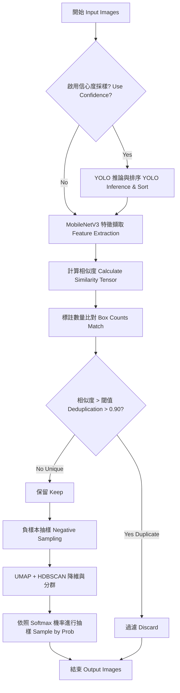

# Sampling 模組細節 (Sampling Module Implementation Details)

## 概述

Sampling 模組的核心目的是自動化過濾與清洗行車紀錄器中擷取的大量重複圖片，並進行高質量的負樣本抽樣、驗證集清洗與自動標記。重構後的版本 (`Tools/sampling/`) 將所有功能模組化，統一使用 PIL 進行圖像處理，並支援 CLI 參數化執行。

本模組包含以下核心工具：
- **圖片去重** (`main.py` + `embedding.py`): 基於 MobileNetV3 特徵向量的餘弦相似度去重
- **負樣本抽樣** (`sampling.py` + `extract_negative.py`): UMAP + HDBSCAN 分群 + Softmax 機率抽樣
- **驗證集清洗** (`val_clean.py`): YOLO 信心度門檻過濾 + 自動標註輸出
- **自動標記分類** (`auto_label.py`): K-Means 分群 + Top-K 選取
- **資料獲取** (`youtube_dataset.py`, `local_dataset.py`): YouTube 爬蟲與本地檔案掃描
- **統一測試工具** (`test_runner.py`): 支援 YouTube/影片/圖片/單一檔案測試

## 演算法流程

本模組包含圖片去重與抽樣兩個主要階段，流程如下：



## 核心技術與架構改進

### 1. 抽離共用邏輯 (`utils.py`)
- **特徵擷取與推論封裝**：提取了 MobileNetV3 的載入與特徵擷取 (`FeatureExtractor`)，以及 YOLO 模型的推論封裝 (`YoloAnalyzer`)。
- **自動 GPU 加速**：所有神經網路運算都會自動偵測並使用 GPU (`cuda`) 以提升運算速度。
- **異常防護**：加入安全的圖片讀取機制 (`safe_image_open`)，確保遇到損壞的圖片時能跳過並發出警告，不中斷整體流程。
- **批次處理支援**：`FeatureExtractor` 新增 `extract_features_from_paths()` 方法，支援批次特徵提取。

### 2. 解決 OOM 與效能瓶頸 (`embedding.py`)
- 將原本基於 `np.dot` 的相似度矩陣運算，升級為依賴 PyTorch 的 Tensor 運算 (`torch.mm`)。
- 這樣能讓大型矩陣相乘在 GPU 上直接執行，大幅改善大量圖片去重時的效能並避免記憶體溢出 (OOM)。

### 3. 資料獲取模組 (`youtube_dataset.py`, `local_dataset.py`)
- **YouTube 串流處理**：不再下載整部影片，而是利用 `yt-dlp` 擷取直連串流網址，避免常見的 "Waiting for stream 0" 問題，並大幅減少硬碟佔用。
- **YouTube 爬蟲**：使用 Selenium 自動滾動頁面爬取指定頻道的影片連結。
- **本地資料掃描**：`LocalDataset` 支援掃描資料夾中的影片（mp4/avi/mov/ts）與圖片（jpg/jpeg/png）檔案。

### 4. 推論與擷取策略
- **5 FPS 策略**：使用 OpenCV 以每秒 5 幀 (5 FPS) 的速率處理影片串流，確保對交通事件的充分覆蓋，同時避免產生過多冗餘資料。
- **信心度過濾**：偵測結果根據其最高信心度進行分類：
  - **自動標記 (Auto Labeled, `max_conf >= 0.8`)**：高信心度幀作為自動標記候選。
  - **負樣本 (Negative Sample, `0.2 < max_conf < 0.65`)**：使模型產生中低信心度誤判的困難負樣本候選。
- **時間間隔限制 (3 秒法則)**：為了防止候選池被近乎相同的連續幀佔據，嚴格執行 3 秒 (15 個處理幀) 的間隔限制。
- **磁碟暫存技術**：候選幀會立即存入磁碟暫存目錄，RAM 中僅保留元數據，避免記憶體耗盡 (OOM)。

### 5. 自動標記分類 (`auto_label.py`)
- 對高信心度候選圖片進行 K-Means 分群，從每個群集中挑選信心度 Top-K 的樣本，確保場景多樣性。
- 可獨立使用，掃描任何影像資料夾並產出高品質的多樣化資料集。

## 工具使用方式 (CLI Commands)

所有腳本已去除硬編碼路徑 (Hardcoded Paths)，現在需透過 `argparse` 動態傳入參數。支援 `-h` 參數查詢詳細用法。

### 圖片去重 (`main.py`)
依據影像特徵或 YOLO 信心度過濾高度相似的重複圖片。
```bash
python sampling/main.py \
    --input_folder "您的原始圖片資料夾路徑" \
    --output_folder "去重後的輸出路徑" \
    --threshold 0.90 \
    --yolo_weights "您的最佳權重檔(best.pt)路徑" \
    --use_confidence
```
*(如果不需依靠 YOLO 信心度去重，可省略 `--use_confidence` 及 `--yolo_weights`)*

### 負樣本抽樣 (`sampling.py`)
利用 UMAP 降維與 HDBSCAN 分群，再根據各群 YOLO 平均信心度換算為抽樣機率，從去重後的圖片中抽取指定數量的負樣本。
```bash
python sampling/sampling.py \
    --input_folder "去重後的圖片資料夾路徑" \
    --output_folder "抽樣結果存放資料夾路徑" \
    --num_samples 400 \
    --yolo_weights "您的最佳權重檔(best.pt)路徑" \
    --temperature 5.0
```

### 驗證集清洗 (`val_clean.py`)
根據指定的 YOLO 信心度閥值 (預設 0.6)，從特定資料夾中篩選圖片，並自動建立對應的 YOLO 格式 `images` 及 `labels` 標註檔案。
```bash
python sampling/val_clean.py \
    --source_path "來源圖片資料夾路徑" \
    --out_path "清洗後輸出的資料夾路徑" \
    --yolo_weights "您的最佳權重檔(best.pt)路徑" \
    --threshold 0.6
```

### 統一測試工具 (`test_runner.py`)
支援多種來源的 YOLO 推論測試工具，取代原先的 `test.py`。
```bash
# 測試本地影片資料夾
python test_runner.py --source video --path ./test_video --yolo_weights best.engine

# 測試本地圖片資料夾
python test_runner.py --source image --path ./test_images --yolo_weights best.engine

# 測試 YouTube 串流
python test_runner.py --source youtube --count 5 --yolo_weights best.engine

# 測試單一檔案
python test_runner.py --source file --path ./test.mp4 --yolo_weights best.engine
```

### 資料獲取模組（可被程式化呼叫）
```python
from youtube_dataset import YoutubeDataset
dataset = YoutubeDataset(target_count=200)
sources = dataset.get_sources()  # 回傳 YouTube 影片 URL 列表

from local_dataset import LocalDataset
dataset = LocalDataset("./test_video")
sources = dataset.get_sources()  # 回傳本地檔案路徑列表
```

## 模組依賴關係

```
test_runner.py
  ├── youtube_dataset.py   ← YouTube 測試
  ├── local_dataset.py     ← 本地影片/圖片測試
  └── YOLO（直接使用 ultralytics）

embedding.py + main.py     ← 去重工具（可獨立使用）
  └── utils.py

sampling.py                ← 負樣本抽樣工具（可獨立使用）
  └── extract_negative.py + utils.py

val_clean.py               ← 驗證集清洗（可獨立使用）
  └── YOLO（直接使用 ultralytics）

auto_label.py              ← Auto Label 分類（可獨立使用或被引用）
  └── utils.py
  