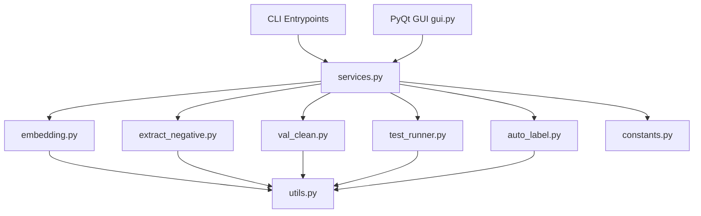
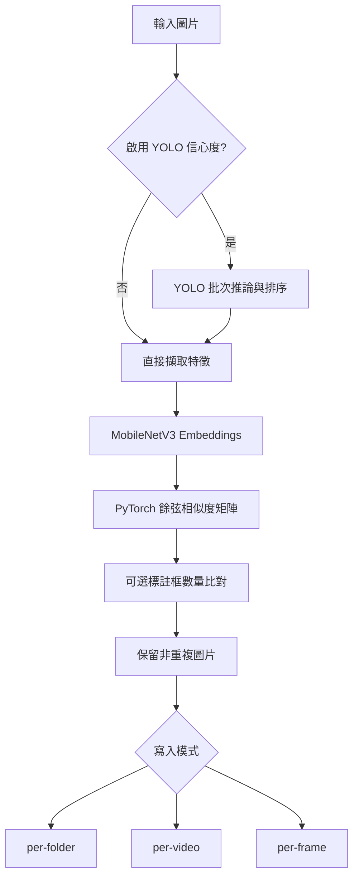
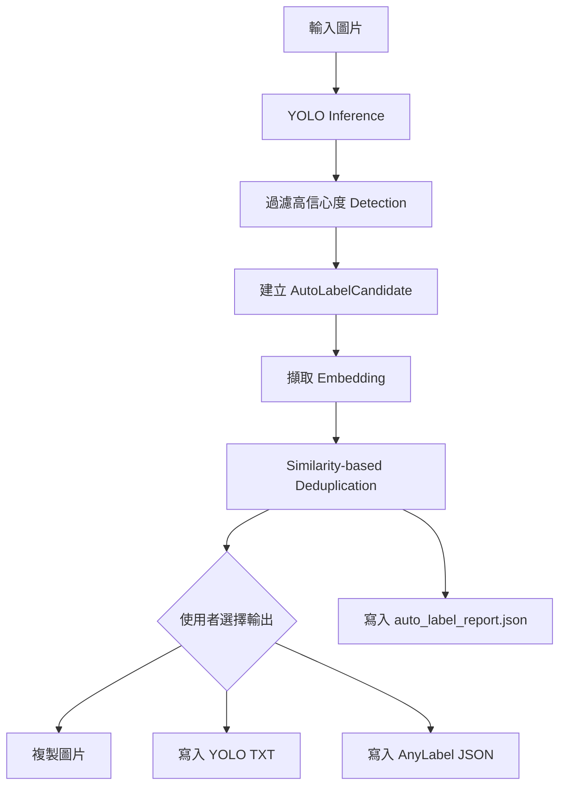

# Sampling 模組實作細節

## 概述

`Tools/sampling/` 已從零散腳本演進為 TVRA 的資料工程工作台，主要負責：

- 過濾行車紀錄器擷取的大量重複圖片
- 抽取高價值負樣本
- 清洗驗證集並輸出 YOLO 標註
- 執行 YOLO 圖片 / 影片 / 單檔 / YouTube 測試流程
- 從高信心度偵測結果產生 Auto Label 輸出

目前架構分為三層：

1. **CLI 入口**：`main.py`、`sampling.py`、`val_clean.py`、`test_runner.py`
2. **共用 workflow service layer**：`services.py`
3. **PyQt 多分頁 GUI workbench**：`gui.py`

也就是說，本模組不再只是單一圖片去重工具，而是同時提供可重用服務層與互動式 GUI 的資料工程工作台。

## 目前核心工具

- **圖片去重** (`main.py` + `embedding.py` + `services.py`)
  - MobileNetV3 特徵向量擷取
  - 餘弦相似度去重
  - 可選 YOLO 信心度排序與標註框數量比對
  - 支援 `per-folder`、`per-video`、`per-frame` 寫入模式
- **負樣本抽樣** (`sampling.py` + `extract_negative.py` + `services.py`)
  - UMAP 降維
  - HDBSCAN 分群
  - Temperature-controlled Softmax 抽樣機率
- **驗證集清洗** (`val_clean.py` + `services.py`)
  - YOLO 信心度門檻過濾
  - 輸出 `images/` 與 `labels/` 清洗後資料集
- **YOLO 測試 workflow** (`test_runner.py` + `services.py`)
  - 支援 image / video / file / YouTube
- **Auto Label workflow** (`auto_label.py` + `services.py` + `gui.py`)
  - YOLO 高信心度候選建立
  - embedding similarity 去重保留多樣樣本
  - 可輸出圖片、YOLO `.txt`、AnyLabel/LabelMe 相容 `.json`
  - 產生 `auto_label_report.json`
- **GUI Workbench** (`gui.py`)
  - 以多分頁整合所有主要資料工程流程

## 架構快照



## Workflow 摘要

### 1. 圖片去重



### 2. Auto Label Workflow



## 核心技術與架構改進

### 1. 共用邏輯抽離 (`utils.py`, `constants.py`, `services.py`)

- `FeatureExtractor` 封裝 MobileNetV3 特徵擷取。
- `YoloAnalyzer` 封裝 YOLO 推論，預設支援 `stream=True` 以降低 OOM 風險。
- `safe_image_open()` 避免損壞圖片中斷整體流程。
- `constants.py` 集中管理圖片/影片副檔名與檔案蒐集 helper。
- `services.py` 統一 GUI 與未來 CLI/service 呼叫方式。
- 目前多數模組已支援 package execution 與 script execution 兩種 import 方式：
  - `python -m Tools.sampling.gui`
  - `python Tools/sampling/gui.py`

### 2. OOM 與效能改善 (`embedding.py`)

- 相似度矩陣從傳統 `np.dot` 風格改為 PyTorch tensor 運算 (`torch.mm`)。
- 可在 GPU 上執行大型矩陣相乘，降低大量圖片去重時的效能瓶頸。
- 去重時可搭配標註框數量比對，避免物件數不同但背景相似的圖片被誤刪。

### 3. Service Layer (`services.py`)

目前 service layer 包含：

- `DeduplicationService`
- `NegativeSamplingService`
- `ValidationCleanService`
- `YoloTestService`
- `AutoLabelService`

GUI 不再直接把所有底層腳本邏輯寫在視窗類別中，而是透過 service layer 呼叫 workflow，使 CLI / GUI / 後續 API 更容易共用。

### 4. GUI Workbench (`gui.py`)

目前正確的 GUI 是**多分頁資料工程工作台**，不是早期單用途去重視窗。

GUI 分頁包含：

- 圖片去重
- 負樣本抽樣
- 驗證集清洗
- YOLO 測試
- Auto Label

GUI 也包含：

- 共用背景 worker (`TaskWorker`)
- progress callback
- 統一 logging panel
- path row helper
- logging bridge cleanup，避免 Qt 物件關閉後 logging handler 殘留導致 atexit 錯誤

### 5. Auto Label Workflow (`auto_label.py`)

目前 Auto Label 已不是舊版 `K-Means + Top-K` 分類器。

新版實作包含：

- `DetectionBox` dataclass
- `AutoLabelCandidate` dataclass
- `AutoLabelSelector`：使用 embedding similarity 去重
- `AutoLabelWorkflow`：負責 YOLO 候選建立、選樣、輸出與 report

支援 writer：

- `ImageCopyWriter`
- `YoloTxtWriter`
- `AnyLabelJsonWriter`

輸出報告：

- `auto_label_report.json`

> 注意：檔案底部保留 `AutoLabelClassifier = AutoLabelSelector` 作為舊 import 的相容 alias，但正式文件與 GUI 應以 `AutoLabelWorkflow` / `AutoLabelService` 為準。

## CLI Commands

所有 CLI-oriented scripts 使用 `argparse`，不應依賴硬編碼路徑。

### 圖片去重 (`main.py`)

```bash
python -m Tools.sampling.main \
    --input_folder "原始圖片資料夾" \
    --output_folder "去重輸出資料夾" \
    --threshold 0.90 \
    --yolo_weights "best.pt" \
    --use_confidence \
    --write_mode per-folder
```

若不使用 YOLO 信心度排序，可省略：

```bash
python -m Tools.sampling.main \
    --input_folder "原始圖片資料夾" \
    --output_folder "去重輸出資料夾" \
    --threshold 0.90
```

### 負樣本抽樣 (`sampling.py`)

```bash
python -m Tools.sampling.sampling \
    --input_folder "去重後圖片資料夾" \
    --output_folder "抽樣結果資料夾" \
    --num_samples 400 \
    --yolo_weights "best.pt" \
    --temperature 5.0
```

### 驗證集清洗 (`val_clean.py`)

```bash
python -m Tools.sampling.val_clean \
    --source_path "來源圖片資料夾" \
    --out_path "清洗後輸出資料夾" \
    --yolo_weights "best.pt" \
    --threshold 0.6
```

### 統一測試工具 (`test_runner.py`)

```bash
python -m Tools.sampling.test_runner --source video --path ./test_video --yolo_weights best.engine
python -m Tools.sampling.test_runner --source image --path ./test_images --yolo_weights best.engine
python -m Tools.sampling.test_runner --source youtube --count 5 --yolo_weights best.engine
python -m Tools.sampling.test_runner --source file --path ./test.mp4 --yolo_weights best.engine
```

### GUI 啟動

```bash
python -m Tools.sampling.gui
```

也支援 script 方式：

```bash
python Tools/sampling/gui.py
```

### Auto Label Programmatic Usage

目前 Auto Label 主要透過 GUI 與 `AutoLabelService` 使用：

```python
from pathlib import Path
from Tools.sampling.services import AutoLabelService

service = AutoLabelService(
    yolo_weights="best.pt",
    confidence_threshold=0.8,
    similarity_threshold=0.9,
)

selected = service.execute(
    input_folder=Path("./input_images"),
    output_folder=Path("./auto_label_output"),
    copy_images=True,
    output_yolo_txt=True,
    output_anylabel_json=True,
    keep_confidence=False,
)
```

## 模組依賴關係

```text
gui.py
  └── services.py
      ├── DeduplicationService
      ├── NegativeSamplingService
      ├── ValidationCleanService
      ├── YoloTestService
      └── AutoLabelService

main.py
  └── embedding.py
      └── utils.py + constants.py

sampling.py
  └── extract_negative.py
      └── utils.py + constants.py

val_clean.py
  └── utils.py

test_runner.py
  ├── youtube_dataset.py
  ├── local_dataset.py
  └── utils.py

auto_label.py
  ├── AutoLabelWorkflow
  ├── AutoLabelSelector
  ├── DetectionBox / AutoLabelCandidate
  ├── ImageCopyWriter
  ├── YoloTxtWriter
  ├── AnyLabelJsonWriter
  └── utils.py + constants.py
```

## 目前注意事項

- 若工作區出現單用途 dedup-only `gui.py`，那是舊版。
- 正確 GUI lineage 是多分頁 workbench，並整合 `services.py`。
- Auto Label 應描述為 **YOLO candidate filtering + embedding similarity deduplication + multi-format export**，不是舊版 K-Means / Top-K。
- 文件、GUI、service layer、`auto_label.py` 必須一起維護，避免 GUI 顯示功能但 service import 不到實作類別。
