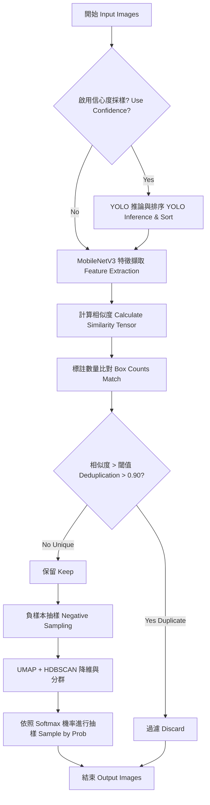

# Sampling Flowchart

```mermaid
graph TD
    A[開始 Input Images] --> B{啟用信心度採樣? Use Confidence?}
    B -- Yes --> C[YOLO 推論與排序 YOLO Inference & Sort]
    B -- No --> D[MobileNetV3 特徵擷取 Feature Extraction]
    C --> D
    D --> E[計算相似度 Calculate Similarity Tensor]
    E --> F[標註數量比對 Box Counts Match]
    F --> G{相似度 > 閾值 Deduplication > 0.90?}
    G -- Yes Duplicate --> H[過濾 Discard]
    G -- No Unique --> I[保留 Keep]
    
    %% 抽樣階段 Sampling phase (sampling.py)
    I --> J[負樣本抽樣 Negative Sampling]
    J --> K[UMAP + HDBSCAN 降維與分群]
    K --> L[依照 Softmax 機率進行抽樣 Sample by Prob]
    L --> M[結束 Output Images]
    H --> M
```
