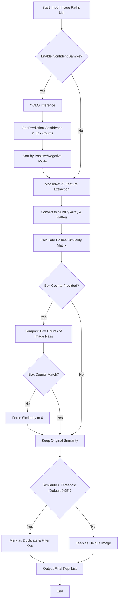

# Sampling Module Implementation Details

## Overview
The core purpose of the Sampling module (`sampling/`) is to automate the filtering and cleaning of large amounts of redundant or similar images extracted from dashcams. It achieves this by combining deep learning feature extraction with object detection. The module primarily consists of `main.py` and `embedding.py` (which contains the `ImageDeduplicator` class).

## Algorithm Workflow

This module implements a two-stage image filtering mechanism:

## Core Technical Details

### 1. YOLO Confident Sampling
- **Model Used**: Loads the trained YOLOv4 model (targeted at license plates/traffic violations).
- **Logic**: Performs preliminary predictions on every image in the list to obtain bounding box confidences. If the goal is to retain high-confidence samples (`positive`), it sorts the list in ascending order of confidence. This ensures that during the subsequent deduplication process, higher-confidence images are prioritized and kept.

### 2. Feature Vector Extraction (Embedding)
- **Model Selection**: Employs the lightweight `MobileNet_V3_Small`. It is fast and highly effective at capturing high-dimensional semantic features of images.
- **Processing**:
  - Replaces the classification layer with `nn.Identity()` to directly output a 1D embedding vector.
  - Applies padding (to 224x224) and normalization to the input image before feeding it to the model.

### 3. Cosine Similarity & Forced Filtering
- **Matrix Operations**: Utilizes NumPy matrix multiplication to rapidly compute the Cosine Similarity across all extracted image features.
- **Box Counts Protection Mechanism**: If two images have exceptionally high similarity, but the predicted number of bounding boxes (Box Counts) from YOLO differs, the algorithm uses a Boolean mask to force their similarity score to zero. This effectively prevents the false deletion of images in scenarios where "the background is nearly identical, but one image has a car and the other does not."

## Execution and Usage
The entry point of the module is `main.py`. Upon execution, the script reads a specified directory, retrieves the filtered list of image paths via `ImageDeduplicator().process_batch()`, and copies the uniquely retained images into a new `cleaned_images` directory.